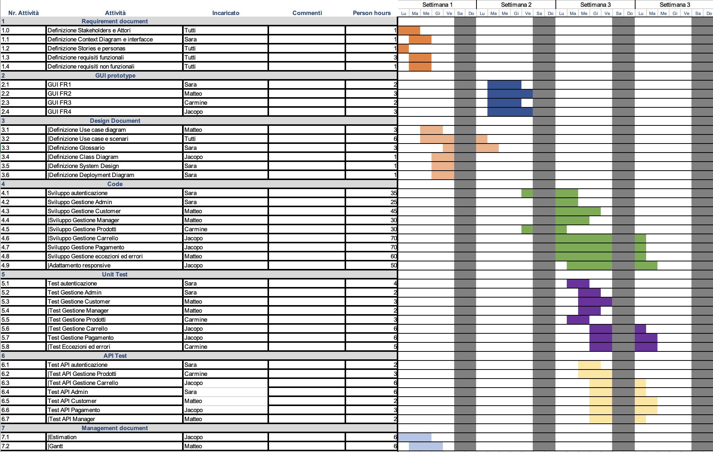

# Project Estimation - FUTURE
Date:

Version:

# Estimation approach
Consider the EZElectronics  project in FUTURE version (as proposed by your team in requirements V2), assume that you are going to develop the project INDEPENDENT of the deadlines of the course, and from scratch (not from V1)
# Estimate by size
### 
|             | Estimate                        |             
| ----------- | ------------------------------- |  
| NC =  Estimated number of classes to be developed   |                7             |             
|  A = Estimated average size per class, in LOC       |              650            | 
| S = Estimated size of project, in LOC (= NC * A) | 4550|
| E = Estimated effort, in person hours (here use productivity 10 LOC per person hour)  |    455                                 |   
| C = Estimated cost, in euro (here use 1 person hour cost = 30 euro) | 13650| 
| Estimated calendar time, in calendar weeks (Assume team of 4 people, 8 hours per day, 5 days per week ) |       2.84            |               

# Estimate by product decomposition
### 
|         component name    | Estimated effort (person hours)   |             
| ----------- | ------------------------------- | 
|requirement document    | 10|
| GUI prototype |5|
|design document |13|
|code |450|
| unit tests |20|
| api tests |20|
| management documents  |10|

# Estimate by activity decomposition
### 
|         Activity name    | Estimated effort (person hours)   |             
| ----------- | ------------------------------- | 
|Definizione Stakeholders e Attori | 1|
|Definizione Context Diagram e interfacce| 1|
|Definizione Stories e personas| 1|
|Definizione requisiti funzionali| 3|
|Definizione requisiti non funzionali| 1|
|Definizione Use case diagram| 3|
|Definizione Use case e scenari| 6|
|Definizione Glossario| 3|
|Definizione Class Diagram| 1|
|Definizione System Design| 1|
|Definizione Deployment Diagram| 1 
|GUI FR1|2|
|GUI FR2|3|
|GUI FR3|2|
|GUI FR4|3|
|Sviluppo autenticazione| 35|
|Sviluppo Gestione Admin|25 |
|Sviluppo Gestione Customer| 45 |
|Sviluppo Gestione Manager|30 |
|Sviluppo Gestione Pagamento| 30| 
|Sviluppo Gestione Prodotti|70 |
|Sviluppo Gestione Carrello| 70 |
|Adattamento responsive| 60|
|Sviluppo Gestione eccezioni ed errori| 50|
| Test autenticazione| 4
| Test Gestione Admin| 2
|Testi Gestione Customer| 3
|Test Gestione Manager| 2
|Test Gestione Pagamento| 3
|Test Gestione Prodotti| 6
|Test Gestione Carrello| 6
|Test Eccezioni ed errori| 5
|Test API autenticazione| 2
|Test API pagamento|3
|Test API Gestione Prodotti| 6
|Test API Gestione Carrello| 6
|Test API Gestione Admin| 2
|Test API Gestione Customer| 3 
|Testi API Gestione Manager| 2
|Estimation| 6|
|Gantt| 6 |
### Gantt Diagram
|

# Summary

Report here the results of the three estimation approaches. The  estimates may differ. Discuss here the possible reasons for the difference

|             | Estimated effort                        |   Estimated duration |          
| ----------- | ------------------------------- | ---------------|
| estimate by size |455|~ 2.84
| estimate by product decomposition |528|~ 3.3
| estimate by activity decomposition |514|~ 3.21

