# Graphical User Interface Prototype - CURRENT

Authors: 

Date:

Version:

\<Report here the GUI that you propose for EZElectronics in CURRENT form, as received by teachers. You are free to organize it as you prefer. A suggested presentation matches the Use cases and scenarios defined in the Requirement document. The GUI can be shown as a sequence of graphical files (jpg, png) >

## Autenticazione
### Pagina iniziale
Rappresenta la prima interfaccia con cui l'utente si relaziona

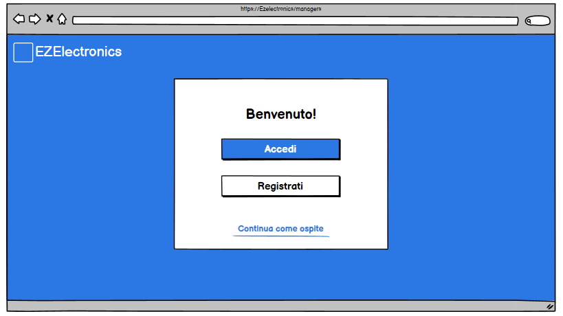

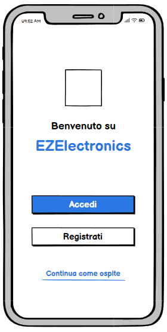

### Login di un utente
Per un Manager/Customer già registrato, l'interfaccia di login è la seguente
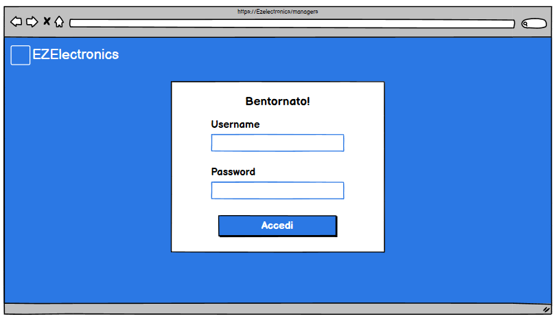

Interfaccia di un Customer che utilizza un dispositivo mobile:
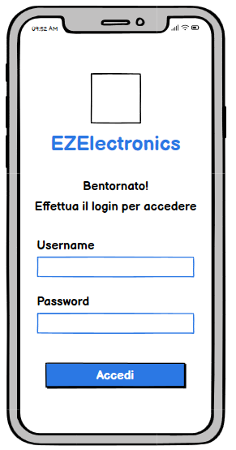

### Registrazione nuovo utente
Per un Manager/Customer che vuole effettuare la registrazioen tramite web, l'interfaccia è la seguente
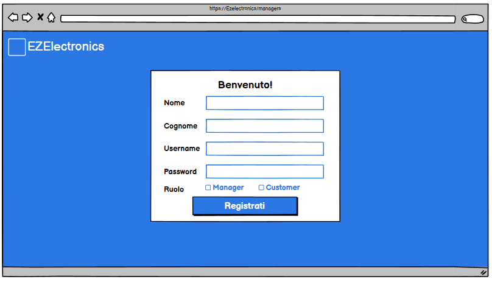

Interfaccia di un Customer che vuole registrarsi tramite dispositivo mobile:
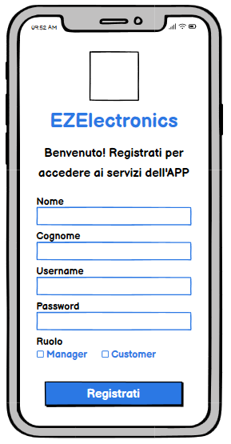

## Gestione Account
### Mostra Profilo

    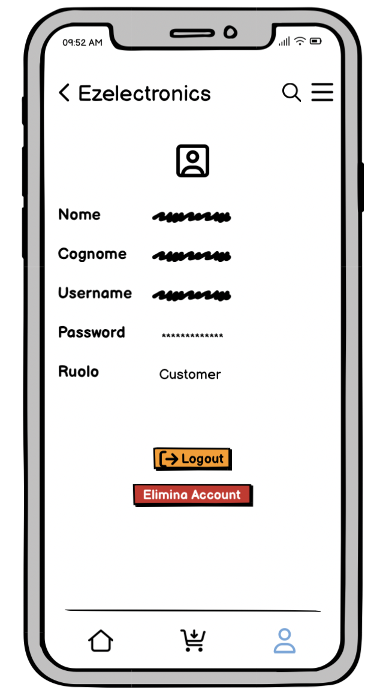

La schermata mostra tutte le informazioni relative all'utente attualmente loggato e offre la possibilità di effetture il logout

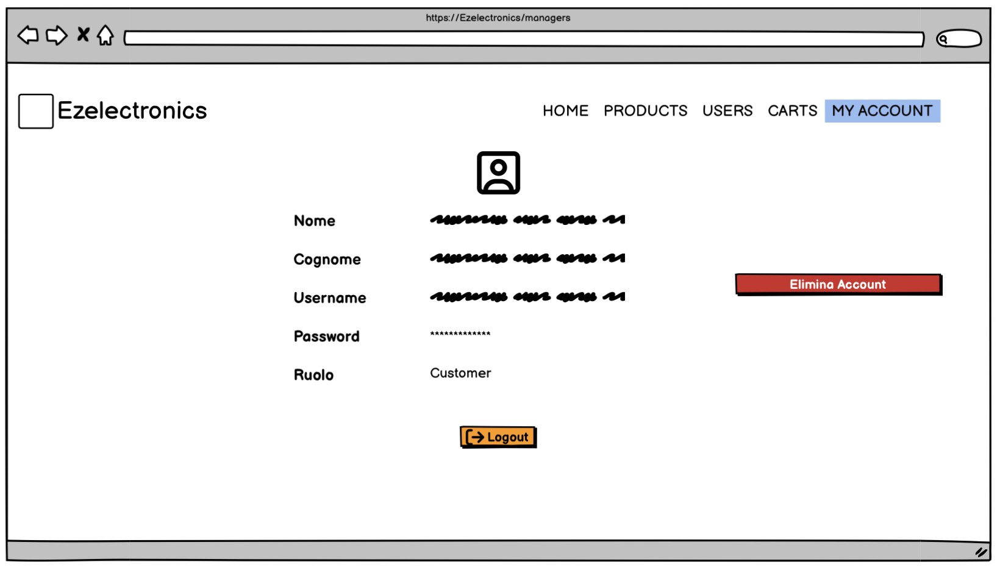

## Gestione Utenti
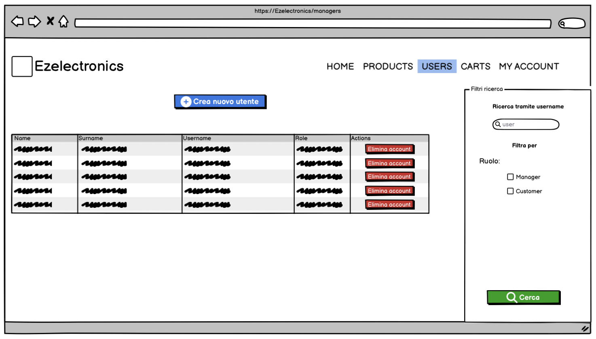

In questa schermata è possibile visualizzare la lista di tutti gli utenti, di effettuare una ricerca inserendo l'username nella parte destra e di filtrare per ruolo selezionando la rispettiva casella.

### Elimina Utente
Cliccando bottone elimina account viene attivata la seguente schermata

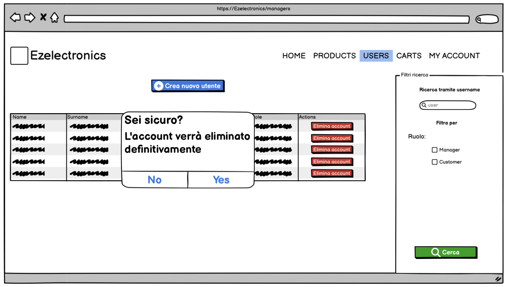

Cliccando su yes l'utente della riga relativa al bottone premuto verrà eliminato definitivamente

### Crea utente
Cliccando sul bottone blu "crea nuovo utente" verrà attivata la seguente schermata.

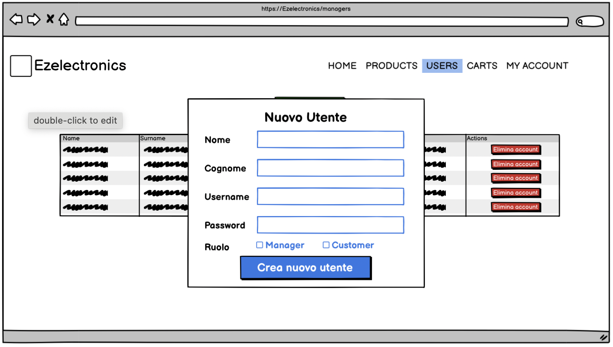

Inserendo i dati e cliccando su "crea nuovo utente" verrà aggiunto un nuovo utente al sistema.

## Gestione prodotti
### Mostra lista completa prodotti, per codice, categoria, modello

In questa schermata vengono mostrati i prodotti con un menu laterale con varie opzioni di ricerca.
Questa è la versione browser del manager con la possibilità di registrare nuovi prodotti e gestire i singoli prodotti, la versione customer invece consente di aggiungere i prodotti al carrello. 

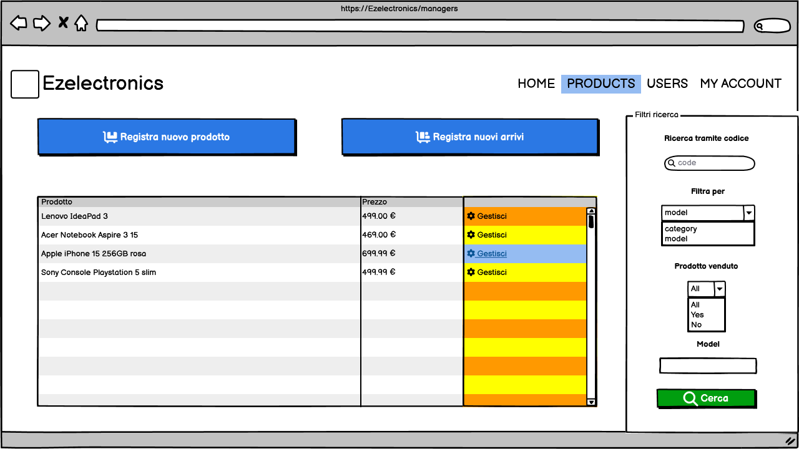

Filtrando per categoria anziché modello, la textbox per inserire il modello viene sostituita da una combobox con le varie categorie. 

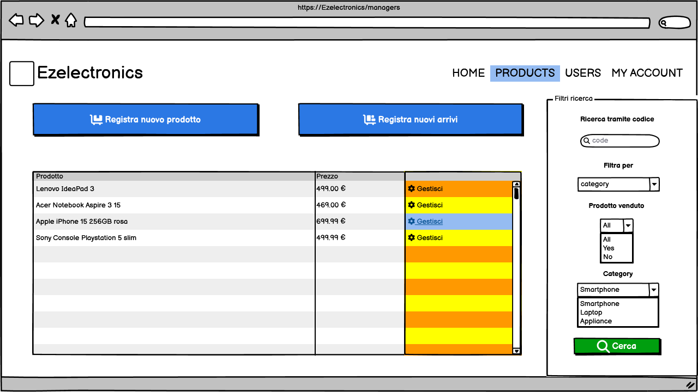
Nella versione mobile del customer è possibile filtrare i prodotti cliccando sulla lente di ingrandimento in alto. 
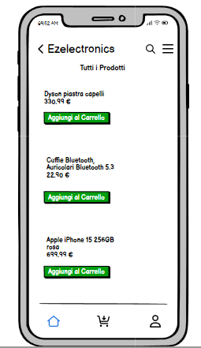

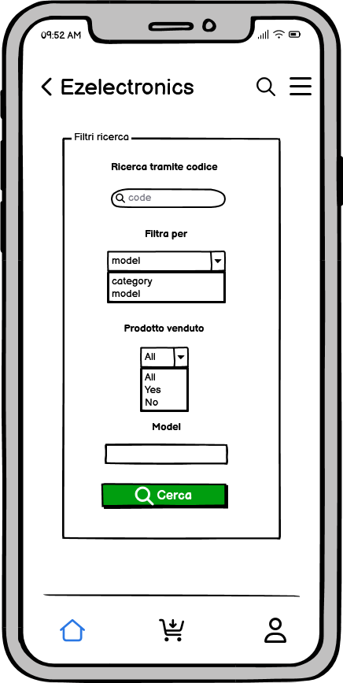

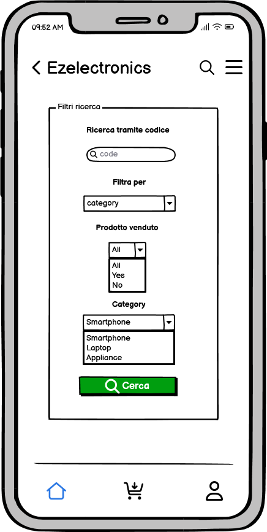

### Dettaglio prodotto

Cliccando sui singoli prodotti sia nella versione browser che mobile oppure sull'opzione "Gestisci" nella versione browser del manager è possibile visualizzare un dettaglio del singolo prodotto. 
Il manager ha la possibilità di segnare il prodotto come venduto o cancellarlo, il customer ha la possibilità di aggiungerlo al carrello.

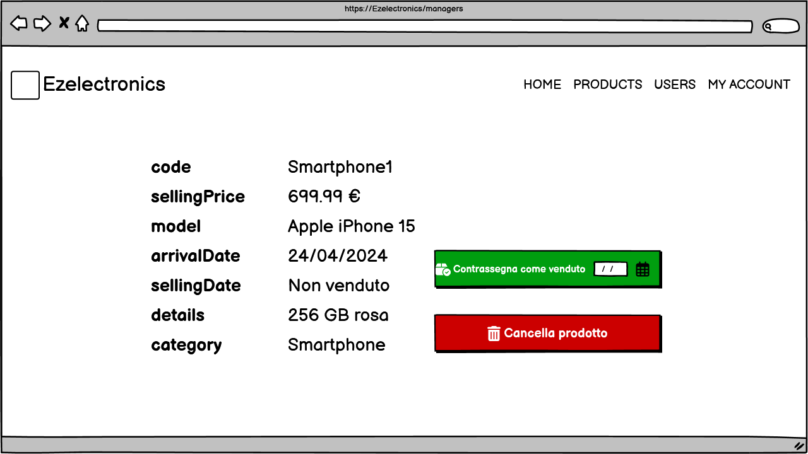

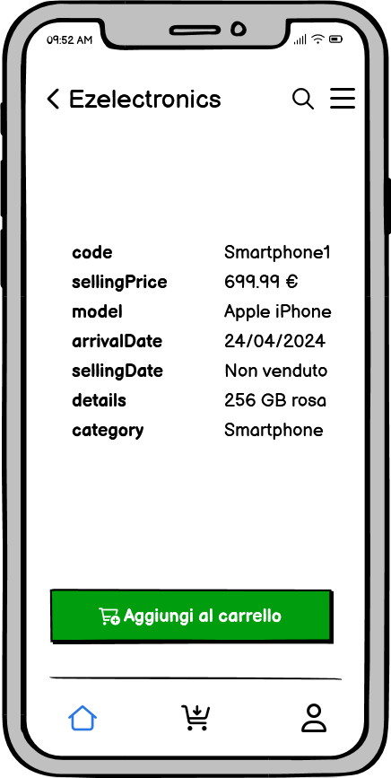

### Registrare nuovi prodotti

Nella versione browser del manager sono disponibili le funzionalità "Registra nuovi arrivi" e "Registra nuovo prodotto, cliccare sui relativi bottoni nell'interfaccia dei prodotti aprirà un form per l'inserimento.

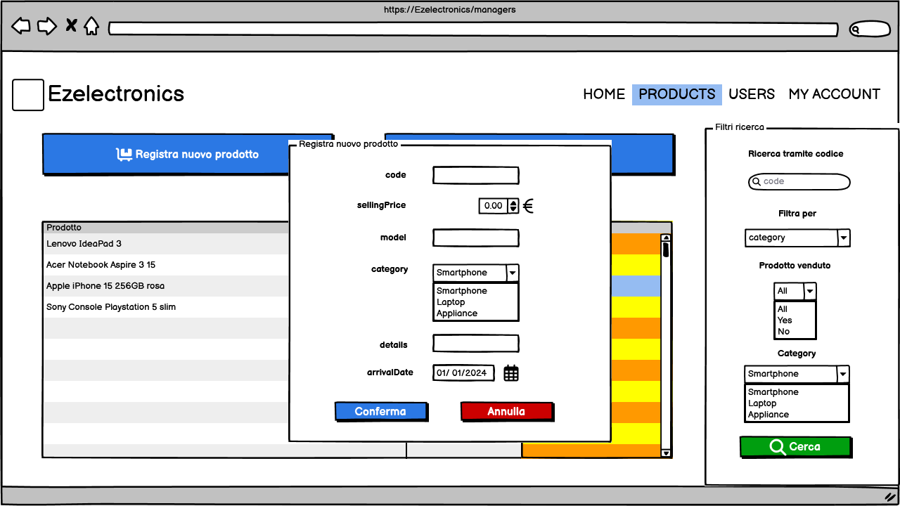

## Gestione carrello
### Mostra carrello, effettua checkout ordine, rimuovi prodotto dal carrello ed elimina carrello

In questa schermata viene mostrato il carrello di un utente.

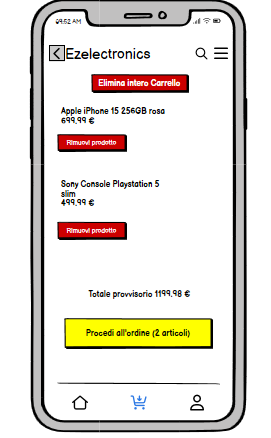

 E' inoltre possibile effettuare il checkout del carrello (cliccando sul bottone "Procedi all'ordine"), rimuovere un prodotto dal carrello (cliccando sul bottone "rimuovi prodotto") oppure svuotare il carrello andando ad eliminare tutti i prodotti (cliccando sul tasto in alto "elimina intero carrello").

## Aggiungi prodotto al carrello
In questa schermata, cliccando sul bottone verde "Aggiungi al Carrello", il prodotto selezionato viene aggiunto al carrello.

E' quindi possibile ora visualizzare il prodotto all'interno del carrello.

## Mostra Ordini
In questa schermata è possibile visualizzare tutti gli ordini effettuati.

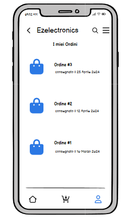