# Graphical User Interface Prototype - FUTURE

Authors:

Date:

Version:

\<Report here the GUI that you propose for EZElectronics in FUTURE form, as proposed by the team. You are free to organize it as you prefer. A suggested presentation matches the Use cases and scenarios defined in the Requirement document. The GUI can be shown as a sequence of graphical files (jpg, png) >

## Autenticazione
### Pagina iniziale
Rappresenta la prima interfaccia con cui l'utente si relaziona

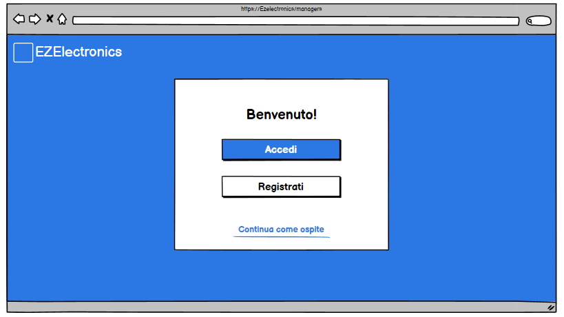

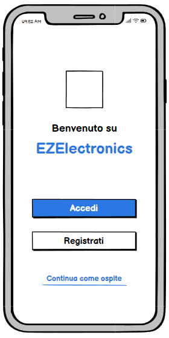

### Login di un utente
Per un Manager/Admin già registrato, l'interfaccia di login è la seguente
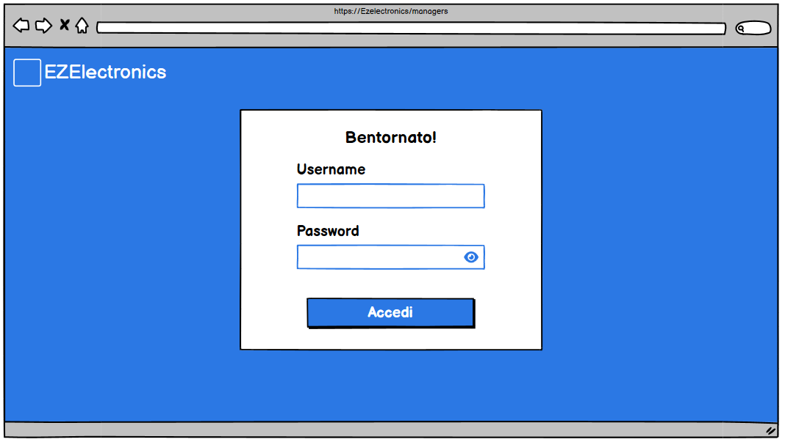

Interfaccia di un Customer che utilizza un dispositivo mobile:
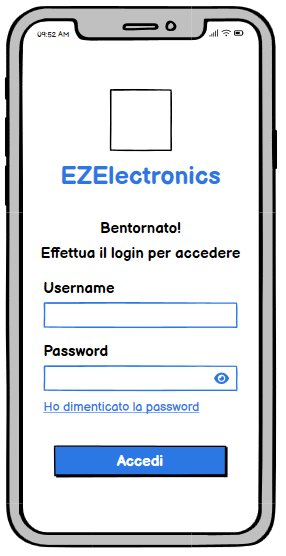

All'interno di queste pagine è presente il link che porta alla sezioen di recupero password.

### Recupera password
Se un Customer dimentica la password per accedere al suo account può utilizzare questa sezione del sito

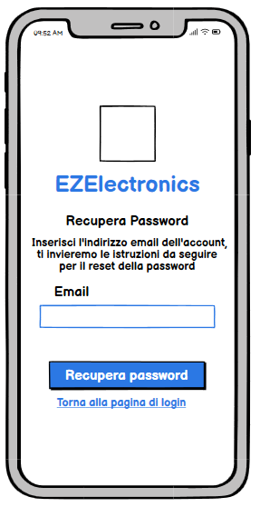

Step successivo: inserire nuova password

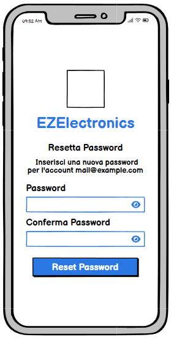

### Registrazione nuovo utente Customer
Per un Customer che vuole effettuare la registrazione tramite dispositivo mobile, l'interfaccia è la seguente

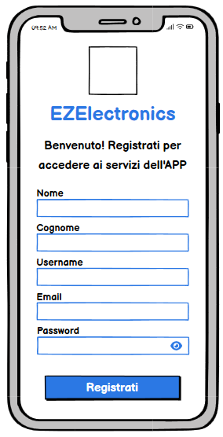

L'interfaccia di un Admin che vuole creare un nuovo account Manager

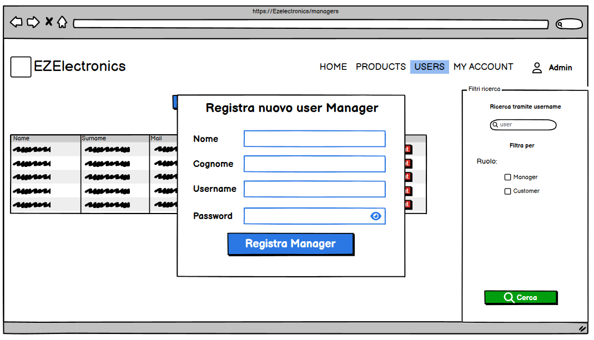

### Visualizzazione Profilo
Interfaccia di un Customer che vuole visualizzare i dati del suo account. All'interno di questa schermata è anche presente l'opzione di logout e di eliminare il proprio account

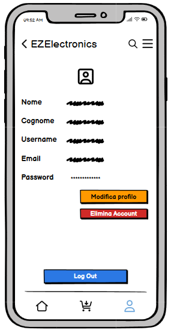

Interfaccia di un Manager che vuole visualizzare i dati del suo account. All'interno di questa schermata è anche presente l'opzione di logout e di eliminare il proprio account

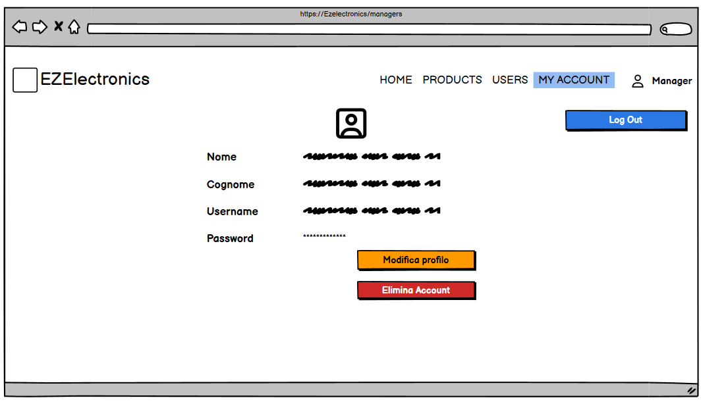

### Modificare dati del proprio account
Interfaccia di un Customer che vuole modificare i dati del suo account

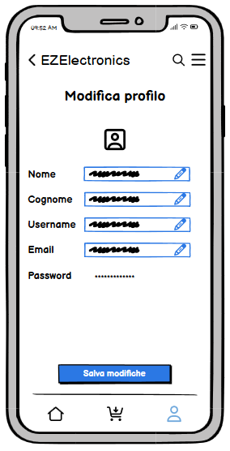

Interfaccia di un Manager che vuole modificare i dati del suo account

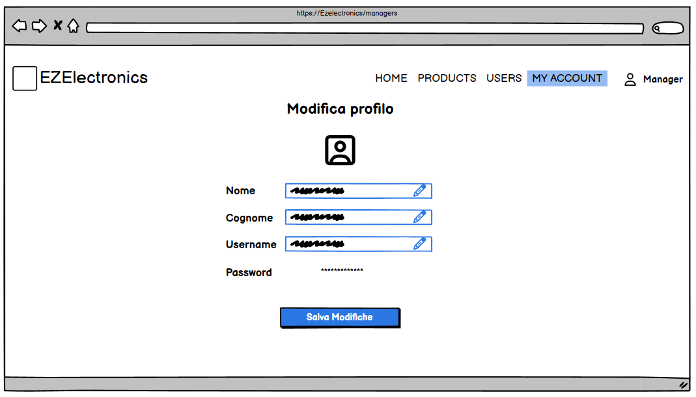

## Gestione Utenti

### Visualizzazione Utenti
L'Admin può visualizzazre la lista di tutti gli utenti tramite apposita interfaccia

### Elimina un utente
L'Admin può eliminare un utnete dalla lista di tutti gli utenti tramite apposita interfaccia

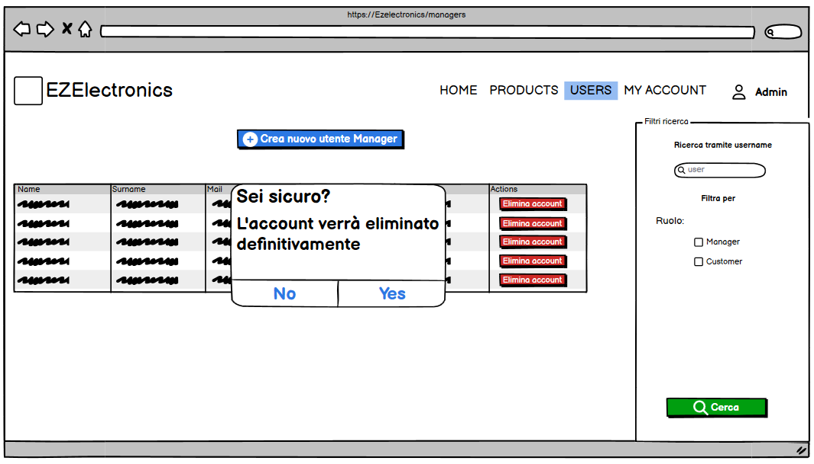

## Gestione prodotti
### Mostra lista completa prodotti, per codice, categoria, modello

In questa schermata vengono mostrati i prodotti con un menu laterale con varie opzioni di ricerca e un menu in basso per ordinare i risultati.
Questa è la versione browser del manager con la possibilità di registrare nuovi prodotti e gestire i singoli prodotti, la versione customer invece consente di aggiungere i prodotti al carrello. 

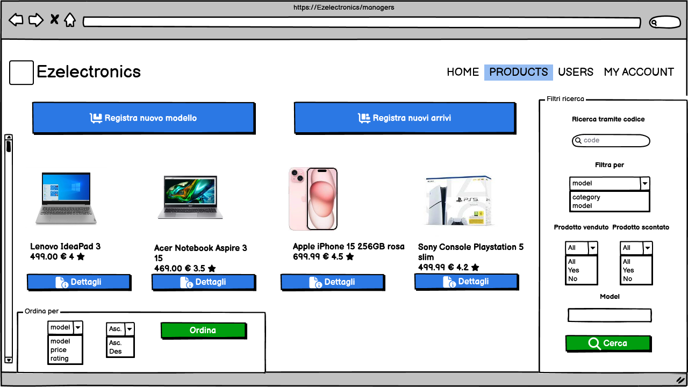

Filtrando per categoria anziché modello, la textbox per inserire il modello viene sostituita da una combobox con le varie categorie. 

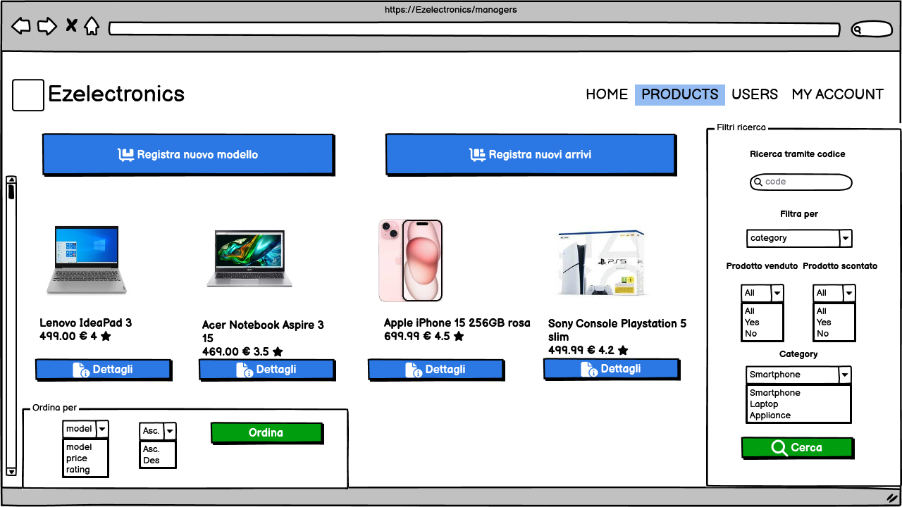
Nella versione mobile del customer è possibile filtrare e ordinare i prodotti cliccando sulla lente di ingrandimento in alto. 
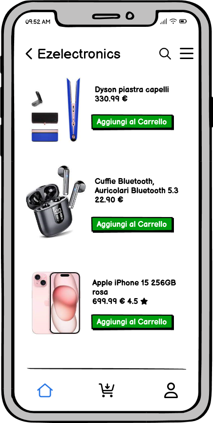

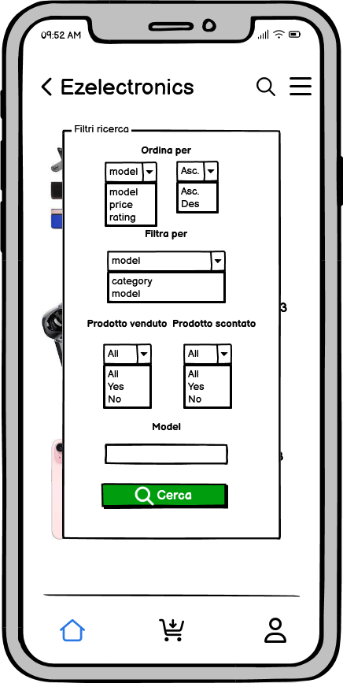

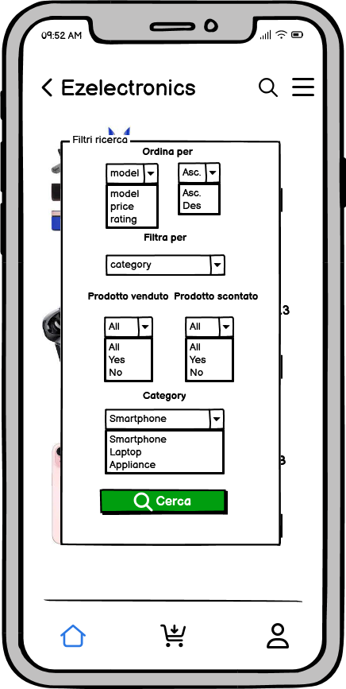

### Dettaglio prodotto

Cliccando sui singoli prodotti sia nella versione browser che mobile oppure sull'opzione "Dettagli" nella versione browser del manager è possibile visualizzare un dettaglio del singolo prodotto. 
Il manager ha la possibilità di gestire i singoli prodotti o modificare i dati del modello, il customer ha la possibilità di aggiungerlo al carrello (bottone verde), aggiungerlo alla lista dei desideri (bottone rosso) o scriverne una rensione (bottone blu).

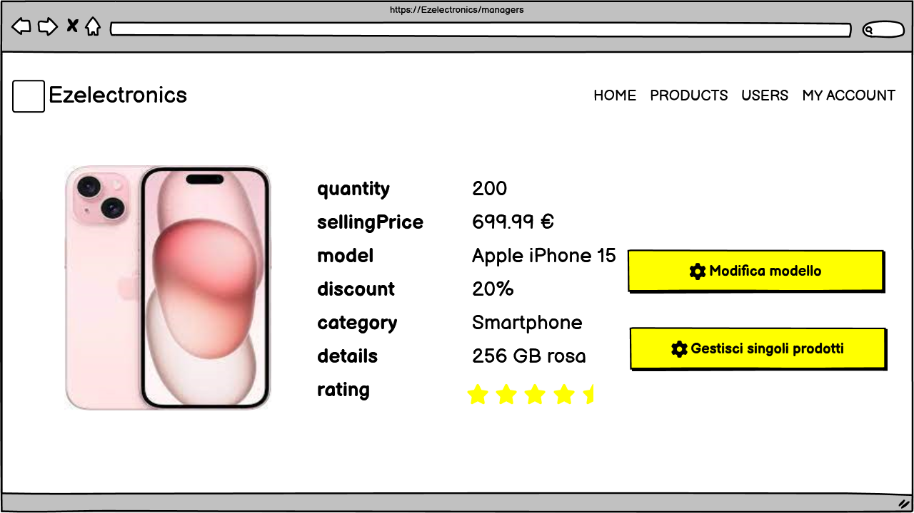

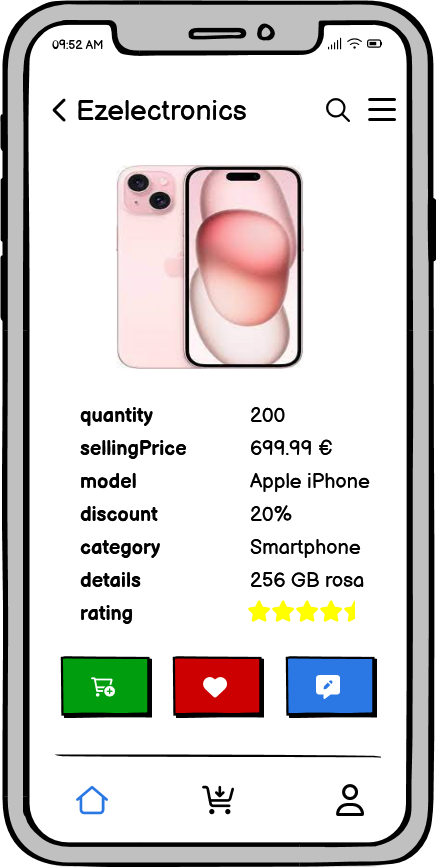

### Registrare nuovi prodotti

Nella versione browser del manager sono disponibili le funzionalità "Registra nuovi arrivi" e "Registra nuovo modello", cliccare sui relativi bottoni nell'interfaccia dei prodotti aprirà un form per l'inserimento.

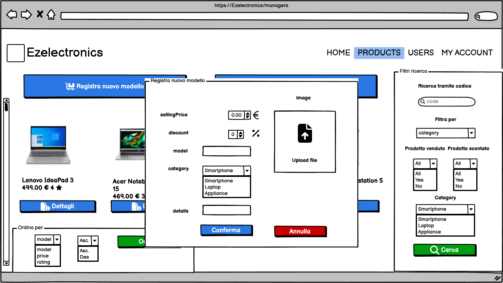

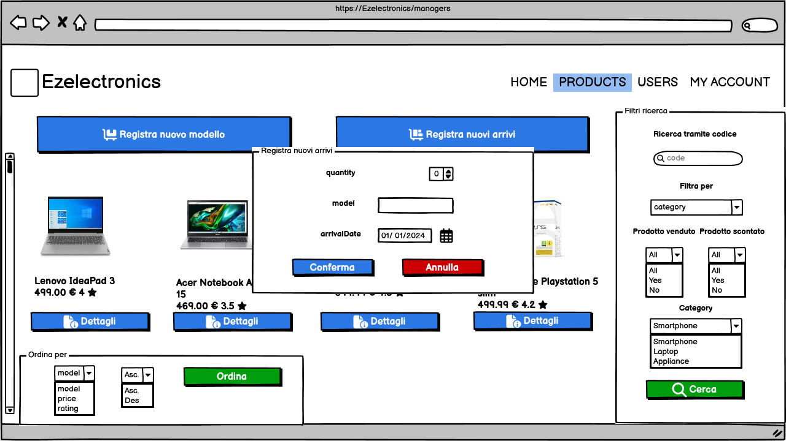

### Gestione prodotti

Nella versione browser del manager sono disponibili le funzionalità "Gestisci singoli prodotti" e "Modifica modello". In  "Gestisci singoli prodotti" è possibile modificare la data di arrivo del prodotto digitandola sulla tabella e cliccando sul bottone "Modifica". Ed è anche possibile segnare un prodotto come venduto digitando la data di vendita sulla tabella oppure lasciandola vuota se si vuole utilizzare quella corrente e poi cliccare sul bottone "Contrassegna come venduto".

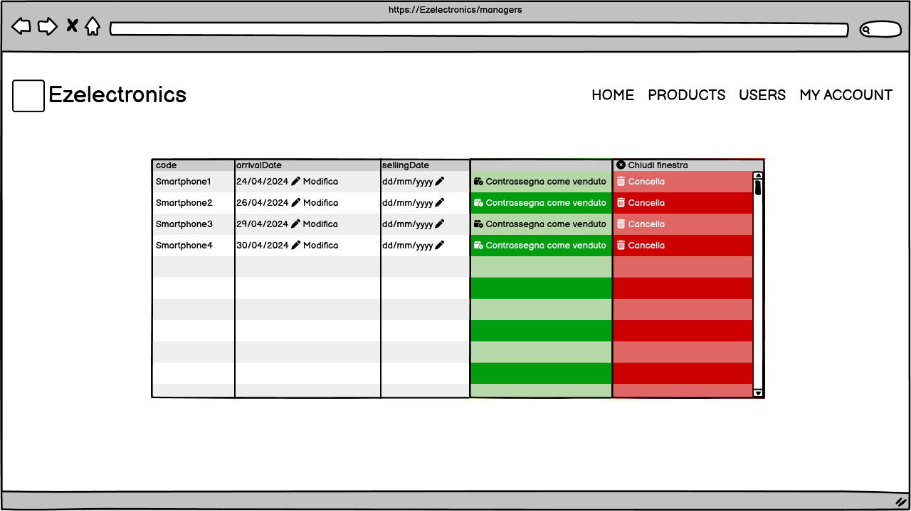

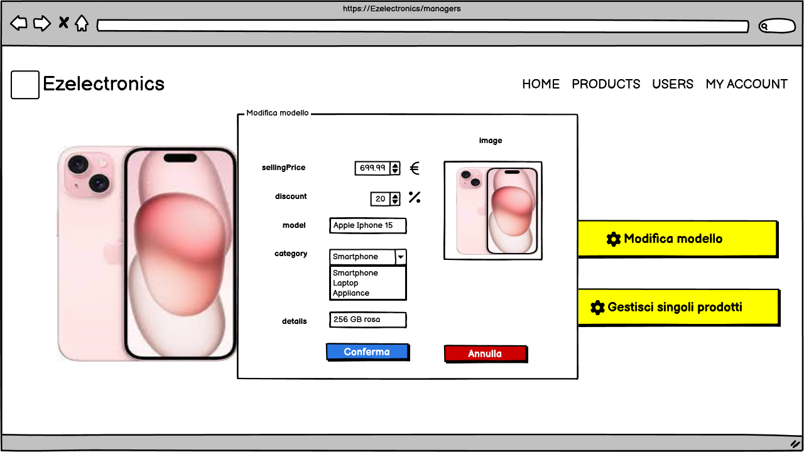

## Recensioni

Nella versione customer è possibile scrivere una recensione di un prodotto.
Nella visualizzazione dei prodotti è mostrato il punteggio medio del prodotto.

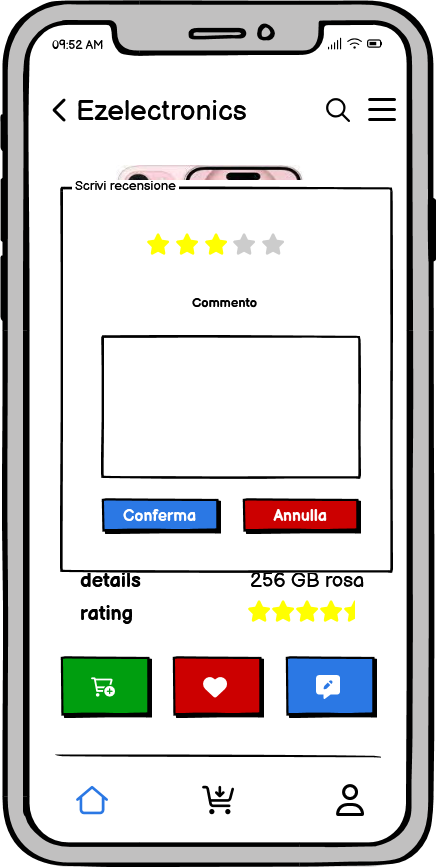

## Gestione carrello
### Mostra carrello, effettua checkout ordine, rimuovi prodotto dal carrello ed elimina carrello

In questa schermata viene mostrato il carrello di un utente.

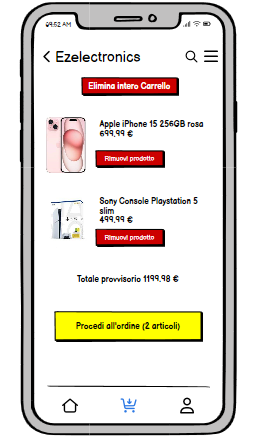

E' inoltre possibile effettuare il checkout del carrello (cliccando sul bottone "Procedi all'ordine"), rimuovere un prodotto dal carrello (cliccando sul bottone "rimuovi prodotto") oppure svuotare il carrello andando ad eliminare tutti i prodotti (cliccando sul tasto in alto "elimina intero carrello").

## Aggiungi prodotto al carrello
In questa schermata, cliccando sul bottone verde "Aggiungi al Carrello", il prodotto selezionato viene aggiunto al carrello.

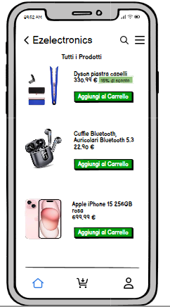

E' quindi possibile ora visualizzare il prodotto all'interno del carrello.

## Mostra Ordini
In questa schermata è possibile visualizzare tutti gli ordini effettuati.

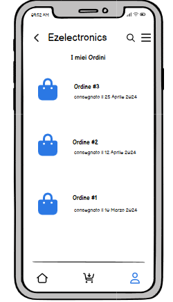

## Pagamento carrello
Una volta premuto il tasto "Procedi all'Ordine" si aprirà un pop-up per inserire tutti i dati della carta di credito con la quale si desidera effettuare il pagamento

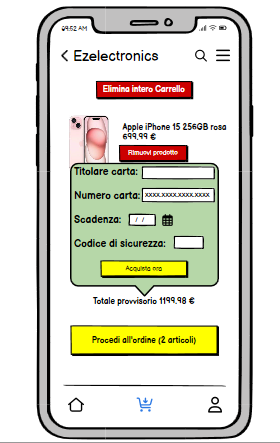

Cliccando su "Acquista ora" si completerà il pagamento

## Scadenza carrello
Se non è stata effettuata nessun'operazione sul carrello per un tot di tempo, quando si aprirà il carrello verrà mostrato un banner che avvertirà il customer che se non effettuerà alcun'operazione entro una data x, il carrello verrà automaticamente svuotato (Verranno rimossi tutti i prodotti al suo interno)

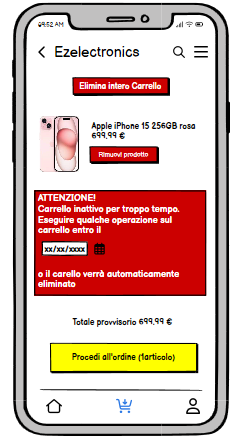