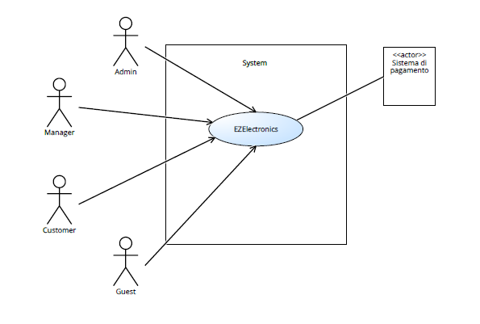
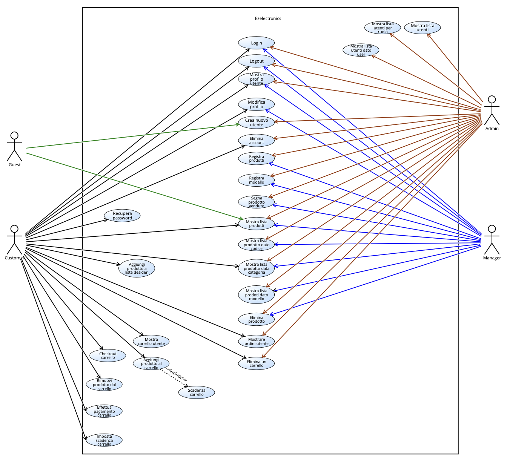
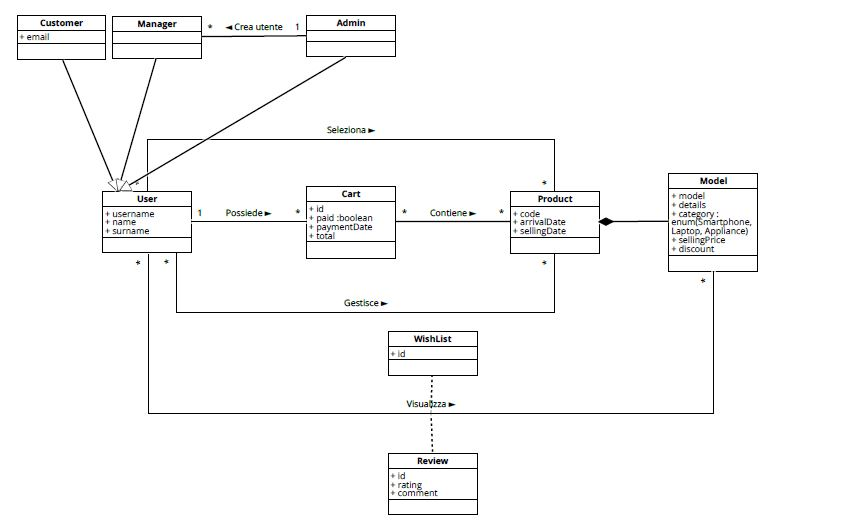
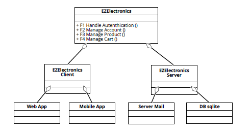
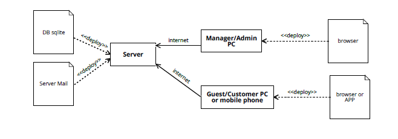

# Requirements Document - future EZElectronics

Date:

Version: V1 - description of EZElectronics in FUTURE form (as proposed by the team)

| Version number | Change |
| :------------: | :----: |
|                |        |

# Contents

- [Requirements Document - future EZElectronics](#requirements-document---future-ezelectronics)
- [Contents](#contents)
- [Informal description](#informal-description)
- [Stakeholders](#stakeholders)
- [Context Diagram and interfaces](#context-diagram-and-interfaces)
  - [Context Diagram](#context-diagram)
  - [Interfaces](#interfaces)
- [Stories and personas](#stories-and-personas)
  - [Personas](#personas)
  - [Stories](#stories)
- [Functional and non functional requirements](#functional-and-non-functional-requirements)
  - [Functional Requirements](#functional-requirements)
  - [Non Functional Requirements](#non-functional-requirements)
  - [Table of Access Rights](#table-of-access-rights)
- [Use case diagram and use cases](#use-case-diagram-and-use-cases)
  - [Use case diagram](#use-case-diagram)
    - [Use case 1.1, UC1.1 Log in di un utente](#use-case-11-uc11-log-in-di-un-utente)
        - [Scenario 1.1.1](#scenario-111)
        - [Scenario 1.1.2](#scenario-112)
        - [Scenario 1.1.3](#scenario-113)
    - [Use case 1.2, UC1.2 Log out di un utente](#use-case-12-uc12-log-out-di-un-utente)
        - [Scenario 1.2.1](#scenario-121)
    - [Use case 1.3, UC1.3 Mostra il profilo dell'utente](#use-case-13-uc13-mostra-il-profilo-dellutente)
      - [Scenario 1.3.1](#scenario-131)
      - [Scenario 1.3.2](#scenario-132)
    - [Use case 1.4, UC1.4 Recupera password](#use-case-14-uc14-recupera-password)
      - [Scenario 1.4.1](#scenario-141)
    - [Use case 1.5, UC1.5 Modifica profilo](#use-case-15-uc15-modifica-profilo)
      - [Scenario 1.5.1](#scenario-151)
      - [Scenario 1.5.2](#scenario-152)
    - [Use case 2.1, UC2.1 Crea un nuovo utente](#use-case-21-uc21-crea-un-nuovo-utente)
      - [Scenario 2.1.1](#scenario-211)
      - [Scenario 2.1.2](#scenario-212)
      - [Scenario 2.1.3](#scenario-213)
      - [Scenario 2.1.4](#scenario-214)
      - [Scenario 2.1.5](#scenario-215)
      - [Scenario 2.1.6](#scenario-216)
    - [Use case 2.2, UC2.2 Restituisce la lista di tutti gli utenti](#use-case-22-uc22-restituisce-la-lista-di-tutti-gli-utenti)
      - [Scenario 2.2.1](#scenario-221)
    - [Use case 2.3, UC2.3 Restituisce la lista di tutti gli utenti filtrati per ruolo](#use-case-23-uc23-restituisce-la-lista-di-tutti-gli-utenti-filtrati-per-ruolo)
      - [Scenario 2.3.1](#scenario-231)
    - [Use case 2.4, UC2.4 Mostrare i dati di un utente dato l'username](#use-case-24-uc24-mostrare-i-dati-di-un-utente-dato-lusername)
      - [Scenario 2.4.1](#scenario-241)
      - [Scenario 2.4.2](#scenario-242)
    - [Use case 2.5, UC2.5 Eliminare un utente](#use-case-25-uc25-eliminare-un-utente)
      - [Scenario 2.5.1](#scenario-251)
      - [Scenario 2.5.2](#scenario-252)
      - [Scenario 2.5.3](#scenario-253)
    - [Use case 2.6, UC2.6 Aggiunta prodotto a lista dei desideri](#use-case-26-uc26-aggiunta-prodotto-a-lista-dei-desideri)
      - [Scenario 2.6.1](#scenario-261)
    - [Use case 2.7, UC2.7 Aggiunta recensione ad un prodotto](#use-case-27-uc27-aggiunta-recensione-ad-un-prodotto)
      - [Scenario 2.7.1](#scenario-271)
    - [Use case 3.1, UC3.1 Registra nuovi arrivi](#use-case-31-uc31-registra-nuovi-arrivi)
        - [Scenario 3.1.1](#scenario-311)
        - [Scenario 3.1.2](#scenario-312)
        - [Scenario 3.1.3](#scenario-313)
    - [Use case 3.2, UC3.2 Registra nuovo modello](#use-case-32-uc32-registra-nuovo-modello)
        - [Scenario 3.2.1](#scenario-321)
        - [Scenario 3.2.2](#scenario-322)
        - [Scenario 3.2.3](#scenario-323)
    - [Use case 3.3, UC3.3 Contrassegna un prodotto come venduto](#use-case-33-uc33-contrassegna-un-prodotto-come-venduto)
        - [Scenario 3.3.1](#scenario-331)
        - [Scenario 3.3.2](#scenario-332)
        - [Scenario 3.3.3](#scenario-333)
        - [Scenario 3.3.4](#scenario-334)
    - [Use case 3.4, UC3.4 Mostra lista prodotti](#use-case-34-uc34-mostra-lista-prodotti)
        - [Scenario 3.4.1](#scenario-341)
        - [Scenario 3.4.2](#scenario-342)
        - [Scenario 3.4.3](#scenario-343)
        - [Scenario 3.4.4](#scenario-344)
        - [Scenario 3.4.5](#scenario-345)
    - [Use case 3.5, UC3.5 Mostra prodotto dato il codice](#use-case-35-uc35-mostra-prodotto-dato-il-codice)
        - [Scenario 3.5.1](#scenario-351)
        - [Scenario 3.5.2](#scenario-352)
    - [Use case 3.6, UC3.6 Mostra lista prodotti per categoria](#use-case-36-uc36-mostra-lista-prodotti-per-categoria)
        - [Scenario 3.6.1](#scenario-361)
        - [Scenario 3.6.2](#scenario-362)
        - [Scenario 3.6.3](#scenario-363)
        - [Scenario 3.6.4](#scenario-364)
        - [Scenario 3.6.5](#scenario-365)
    - [Use case 3.7, UC3.7 Mostra lista prodotti per modello](#use-case-37-uc37-mostra-lista-prodotti-per-modello)
        - [Scenario 3.7.1](#scenario-371)
        - [Scenario 3.7.2](#scenario-372)
        - [Scenario 3.7.3](#scenario-373)
        - [Scenario 3.7.4](#scenario-374)
        - [Scenario 3.7.5](#scenario-375)
        - [Scenario 3.7.6](#scenario-376)
    - [Use case 3.8, UC3.8 Cancella un prodotto](#use-case-38-uc38-cancella-un-prodotto)
        - [Scenario 3.8.1](#scenario-381)
    - [Use case 3.9, UC3.9 Modifica data arrivo prodotto](#use-case-39-uc39-modifica-data-arrivo-prodotto)
        - [Scenario 3.9.1](#scenario-391)
        - [Scenario 3.9.2](#scenario-392)
    - [Use case 3.10, UC3.10 Modifica modello](#use-case-310-uc310-modifica-modello)
        - [Scenario 3.10.1](#scenario-3101)
        - [Scenario 3.10.2](#scenario-3102)
        - [Scenario 3.10.3](#scenario-3103)
    - [Use case 4.1, UC4.1 Mostra carrello](#use-case-41-uc41-mostra-carrello)
        - [Scenario 4.1.1](#scenario-411)
    - [Use case 4.2, UC4.2 Aggiungi prodotto al carrello](#use-case-42-uc42-aggiungi-prodotto-al-carrello)
        - [Scenario 4.2.1](#scenario-421)
        - [Scenario 4.2.2](#scenario-422)
        - [Scenario 4.2.3](#scenario-423)
        - [Scenario 4.2.4](#scenario-424)
    - [Use case 4.3, UC4.3 Effettua checkout del carrello](#use-case-43-uc43-effettua-checkout-del-carrello)
        - [Scenario 4.3.1](#scenario-431)
        - [Scenario 4.3.2](#scenario-432)
        - [Scenario 4.3.3](#scenario-433)
    - [Use case 4.4, UC4.4 Mostra ordini di un costumer specifico](#use-case-44-uc44-mostra-ordini-di-un-costumer-specifico)
        - [Scenario 4.4.1](#scenario-441)
        - [Scenario 4.4.2](#scenario-442)
    - [Use case 4.5, UC4.5 Rimuovi prodotto dal carrello](#use-case-45-uc45-rimuovi-prodotto-dal-carrello)
        - [Scenario 4.5.1](#scenario-451)
        - [Scenario 4.5.2](#scenario-452)
        - [Scenario 4.5.3](#scenario-453)
        - [Scenario 4.5.4](#scenario-454)
        - [Scenario 4.5.5](#scenario-455)
    - [Use case 4.6, UC4.6 Elimina carrello](#use-case-46-uc46-elimina-carrello)
        - [Scenario 4.6.1](#scenario-461)
        - [Scenario 4.6.2](#scenario-462)
    - [Use case 4.7, UC4.7 Pagamento carrello](#use-case-47-uc47-pagamento-carrello)
        - [Scenario 4.7.1](#scenario-471)
        - [Scenario 4.7.2](#scenario-472)
        - [Scenario 4.7.3](#scenario-473)
        - [Scenario 4.7.4](#scenario-474)
    - [Use case 4.8, UC4.8 Scadenza carrello](#use-case-48-uc48-scadenza-carrello)
        - [Scenario 4.8.1](#scenario-481)
        - [Scenario 4.8.2](#scenario-482)
- [Glossary](#glossary)
- [System Design](#system-design)
- [Deployment Diagram](#deployment-diagram)

# Informal description

EZElectronics (read EaSy Electronics) is a software application designed to help managers of electronics stores to manage their products and offer them to customers through a dedicated website. Managers can assess the available products, record new ones, and confirm purchases. Customers can see available products, add them to a cart and see the history of their past purchases.

# Stakeholders

| Stakeholder name | Description |
| :--------------: | :---------: |
|Admin| utente con permessi speciali che crea nuovi manager e gestisce gli utenti|
| Manager | utente che gestisce i prodotti |
| Customer | utente che vuole comprare i prodotti offerti dal sito EZElectronics |
| Guest | utente senza un account che può visitare il sito EZElectronics |
| Store| Negozio fisico a cui appartiene il sito
|Banca| Gestione dei pagamenti

# Context Diagram and interfaces

## Context Diagram

## Interfaces

L'Admin ed il Manager accedono all'applicazione tramite PC come interfaccia fisica. L'interfaccia logica consiste in una GUI che mostra gli strumenti per la gestione dei prodotti e degli account dei costumer.
I Customer possono accedere all'applicazione tramite smartphone o PC. L'interfaccia logica consiste in una GUI che da la possibilità al costumer di comprare dei prodotti, gestire il carrello e vedere lo storico degli propri ordini.
I guest sono utenti che non hanno creato un account ma possono svolgere azioni limitate.

|  Actor  | Logical Interface | Physical Interface |
| :-------: | :---------------: | :----------------: |
| Admin | GUI| PC
| Manager | GUI | PC |
| Customer | GUI | Smartphone, PC |
| Guest | GUI | Smartphone, PC |

# Stories and personas

## Personas
A è una ragazza giovane che vuole migliorare la sua abitazione con prodotti relativi alla domotica ed autilizza spesso l'applicazione per effetuare ordini online.

B è un Manager di un azienda di prodotti elettronici che gestisce il magazzino, le disponibilità, gli ordini e i prodotti.

C è il proprietario di un negozio di articoli elettronici e vuole gestire la sua azienda tramite il profilo Admin.

D è un cliente abituale del negozio fisico, ma lavorando dalle 8 alle 10 ore al giorno preferisce utilizzare l'applicazione per effettuare gli acquisti.

E è un signore di mezza età che utilizza l'applicazione per visualizzare tutti i prodotti disponibili in negozio senza registrarsi.

## Stories
Chiara è una Customer che vuole comprare il prodotto X. Controlla che il prodotto sia disponibile sul sito EZElectronics; se lo è, lo aggiunge al carrelo e procede al checkout.

Luca è un Manager che lavora per EZElectronics. In seguito all'arrivo di nuovi prodotti nel magazzino li aggiunge sul sito usando la specifica sezione e inserendo codice del prodotto, prezzo di vendita, modello, categoria, data di arrivo in magazzino, numero di pezzi disponibili alla vendita.

Marco è il proprietario del negozio fisico e vuole aggiungere un nuovo manager che gestisca i prodotti. Effettua il login, accede alla sezione degli utenti e crea un nuovo profilo inserendo tutti i dati utili.

Grazia è una giovane proprietaria del negozio fisico e vuole controllare l'andamento delle vendite visualizzando gli ultimi ordini effettuati al fine di ottenere delle statistiche generali.

Antonio è un signore di mezza età che conosce fisicamente il negozio e accede al sito web per visualizzare tutti i nuovi prodotti senza registrarsi per poi recarsi di persona per valutare il prodotto ad effettuare gli acquisti.
# Functional and non functional requirements

## Functional Requirements

\<In the form DO SOMETHING, or VERB NOUN, describe high level capabilities of the system>

\<they match to high level use cases>

|  ID  | Description |
| :---: | :---------: |
|  FR1  | Autenticazione |
|  FR1.1  | Log in di un account esistente |
|  FR1.2  | Log out di un account esistente |
|  FR1.3  | Mostrare all'utente i dati del suo account |
|  FR1.4  | Recupera password|
|  FR1.5  | Modifica profilo|
|  FR2  | Gestione di un account |
|  FR2.1  | Creazione di un nuovo utente |
|  FR2.2  | Mostrare la lista di tutti gli utenti |
|  FR2.3  | Mostrare la lista degli utenti con un ruolo specifico |
|  FR2.4  | Mostrare i dati di un utente dato l'username |
|  FR2.5  | Eliminare l'account di un utente |
| FR2.6 | Aggiungi prodotto a lista dei desideri|
| FR2.7 | Aggiungi recensione a prodotto|
| FR3 | Gestione dei prodotti |
| FR3.1 | Registrare l'arrivo di un nuovo set di prodotti |
| FR3.2 | Registra nuovo modello
| FR3.3 | Segnare un prodotto come venduto |
| FR3.4 | Mostrare la lista di tutti i prodotti |
| FR3.5 | Mostrare un prodotto dato il codice |
| FR3.6 | Mostrare la lista dei prodotti di una determinata categoria |
| FR3.7 | Mostrare la lista dei prodotti di un determinato modello |
| FR3.8 | Eliminare un prodotto |
| FR4 | Gestione carrello di un utente |
| FR4.1 | Mostrare all'utente il suo carrello |
| FR4.2 | Aggiungere un prodotto al carrello |
| FR4.3 | Checkout del carrello di un utente |
| FR4.4 | Mostrare tutti gli ordini di un utente specifico |
| FR4.5 | Rimuovere un prodotto dal carrello |
| FR4.6 | Eliminare un carrello |
| FR4.7 | Effettuare il pagamento di un carrello |
| FR4.8 | Impostare una scadenza per il carrello |

## Non Functional Requirements

\<Describe constraints on functional requirements>

|  ID  | Type (efficiency, reliability, ..) | Description | Refers to |
| :-----: | :--------------------------------: | :---------: | :-------: |
|  NFR1  | Efficienza | Ogni errore viene gestito in modo da non avere mai un crash | FR1, FR2, FR3, FR4 |
|  NFR2  | Usabilità | Gli utenti devono essere in grado di utilizzare immediatamente il software | FR1, FR2, FR3, FR4 |
|  NFR3  | Usabilità  | I managers necessitano di un addestramento sulla gestione dei prodotti e degli utenti |FR1, FR2, FR3, FR4 |
| NFR4 | Sicurezza  | Garantita la privacy dei dati personali| FR1, FR2 |
| NFR5 | Affidabilità | L'utente non deve segnalare più di 4 bug all'anno | FR1, FR2, FR3, FR4 |
| NFR6| Portabilità | Il software deve essere disponibile per più dispositi e più sistemi operativi. Nello specifico per i principali browser come Google Chrome, Safari, Firefox, Edge; per i dispositivi mobile: Android 10, iOS 14 |
|NFR7| Usabilità| La registrazione da parte di un customer non deve durare più di 3 minuti | FR1, FR2, FR3, FR4
|NFR8| Integrità | Il carrello rimane sempre salvato allo stato attuale anche in casi estremi| FR4
|NFR9| Usabilità | L'utente deve essere correttamente guidato con avvisi su quello che sta accadendo| FR1, FR2, FR3, FR4
|NFR10| Mantenibilità |Il software deve essere sviluppato in modo modulare per facilitare la risoluzione di bug e l'aggiunta di nuove funzioanalità| FR1, FR2, FR3, FR4
|NFR11| Integrità| Al momento del checkout i prodotti presenti nel carrello devono essere disponibili per tutta la durata del pagamento fino all'effettiva erogazione dell'ordine| FR4

## Table of Access Rights

|  ID   | Description                                                   | Guest  | Customer | Manager | Admin | 
| :---: | :-----------------------------------------------------------: | :-----: | :-----: | :-----: | :-----:
| FR1.1 | Log in di un account esistente                                |    -    |    X    |    X    |    X    |
| FR1.2 | Log out di un account esistente                               |    -    |    X    |    X    |    X    |
| FR1.3 | Mostrare all'utente i dati del suo account                    |    -    |    X    |    X    |    X    |
| FR1.4 | Recupera password                                             |    -    |    X    |    -    |    -    |
| FR1.5 | Modifica profilo                                              |    -    |    X    |    X    |    -    |
| FR2.1 | Creazione di un nuovo utente                                  |    X    |    -    |    -    |    X    |
| FR2.2 | Mostrare la lista di tutti gli utenti                         |    -    |    -    |    -    |    X    |
| FR2.3 | Mostrare la lista degli utenti con un ruolo specifico         |    -    |    -    |    -    |    X    |
| FR2.4 | Mostrare i dati di un utente dato l'username                  |    -    |    -    |    -    |    X    |
| FR2.5 | Eliminare l'account di un utente                              |    -    |    X    |    -    |    X    |
| FR2.6 | Aggiunta prodotto a lista dei desideri                        |    -    |    X    |    -    |    -    |
| FR2.7 | Aggiunta recensione a un prodotto                             |    -    |    X    |    -    |    -    |
| FR3.1 | Registrare l'arrivo di un nuovo set di prodotti               |    -    |    -    |    X    |    X    |
| FR3.2 | Registrare nuovo modello                                      |    -    |    -    |    X    |    X    |
| FR3.3 | Segnare un prodotto come venduto                              |    -    |    -    |    X    |    X    |
| FR3.4 | Mostrare la lista di tutti i prodotti                         |    X    |    X    |    X    |    X    |
| FR3.5 | Mostrare un prodotto dato il codice                           |    -    |    -    |    X    |    X    |
| FR3.6 | Mostrare la lista dei prodotti di una determinata categoria   |    X    |    X    |    X    |    X    |
| FR3.7 | Mostrare la lista dei prodotti di un determinato modello      |    X    |    X    |    X    |    X    |
| FR3.8 | Eliminare un prodotto                                         |    -    |    -    |    X    |    X    |
| FR3.9 | Modificare data arrivo prodotto                                         |    -    |    -    |    X    |    X    |
| FR3.10 | Modificare modello                                        |    -    |    -    |    X    |    X    |
| FR4.1 | Mostrare all'utente il suo carrello                           |    -    |    X    |    -    |    -    |
| FR4.2 | Aggiungere un prodotto al carrello                            |    -    |    X    |    -    |    -    |
| FR4.3 | Checkout del carrello di un utente                            |    -    |    X    |    -    |    -    |
| FR4.4 | Mostrare tutti gli ordini di un utente specifico              |    -    |    X    |    -    |    X    |
| FR4.5 | Rimuovere un prodotto dal carrello                            |    -    |    X    |    -    |    -    |
| FR4.6 | Eliminare un carrello                                         |    -    |    X    |    -    |    X    |
| FR4.7 | Effettuare il pagamento del carrello                          |    -    |    X    |    -    |    -    |
| FR4.8 | Impostare una scadenza per il carrello                        |    -    |    -    |    -    |    -    |

# Use case diagram and use cases

## Use case diagram

### Use case 1.1, UC1.1 Log in di un utente

| Actors Involved  | Manager, Customer, Admin |
| :--------------: | :------------------------------------------------------------------: |
|  Precondition  | l'utente è registrato (Customer/Manager/Admin) |
|  Post condition  | l'utente è loggato |
| Nominal Scenario | l'utente visita il sito EZElectronics e si autentica per accedere ai servizi offerti |
|  Variants  | - |
|  Exceptions  | l'utente non inserisce username o password |

##### Scenario 1.1.1

|  Scenario 1.1.1  | Log in di un utente registrato |
| :------------: | :------------------------------------------------------------------------: |
| Precondition | l'utente è registrato |
| Post condition | l'utente è loggato |
| Step# | Description |
| 1 | l'utente visita il sito EZElectronics |
| 2 | l'utente inizia la procedura di log in |
| 3 | EZElectronics chiede username e password |
| 4 | l'utente inserisce i dati richiesti per l'autenticazione| 
| 5 | la procedura di log in ha successo| 

##### Scenario 1.1.2

|  Scenario 1.1.2  | Log in di un utente fallito per inserimento dati non corretto  |
| :------------: | :------------------------------------------------------------------------: |
| Precondition | l'utente è registrato |
| Post condition | l'utente non è loggato |
| Step# | Description |
| 1 | l'utente visita il sito EZElectronics |
| 2 | l'utente inizia la procedura di log in |
| 3 | EZElectronics chiede username e password |
| 4 | l'utente lascia vuoto il campo username o password | 
| 5 | la procedura di log in fallisce| 

##### Scenario 1.1.3

|  Scenario 1.1.3  | Log in di un utente non registrato  |
| :------------: | :------------------------------------------------------------------------: |
| Precondition | l'utent non è registrato |
| Post condition | l'utente non è loggato |
| Step# | Description |
| 1 | l'utente visita il sito EZElectronics |
| 2 | l'utente inizia la procedura di log in |
| 3 | EZElectronics chiede username e password |
| 4 | l'utente non è registrato quindi non è a conoscenza di quali username e password inserire | 
| 5 | la procedura di log in non può procedere e il log in dell'utente fallisce| 

### Use case 1.2, UC1.2 Log out di un utente

| Actors Involved  | Manager, Customer, Admin |
| :--------------: | :------------------------------------------------------------------: |
|  Precondition  | l'utente è loggato |
|  Post condition  | l'utente non è loggato |
| Nominal Scenario | l'utente vuole terminare la sessione su EZElectonics  |
|  Variants  | - |
|  Exceptions  | - |

##### Scenario 1.2.1

|  Scenario 1.2.1  | Log out di un utente |
| :------------: | :------------------------------------------------------------------------: |
| Precondition | l'utente è loggato |
| Post condition | l'utente non è loggato |
| Step# | Description |
| 1 | l'utente compie la procedura di log out per terminare la sessione su EZElectronics |
| 2 | EZElectronics fa il log out dell'utente|
| 3 | la sessione è terminata |

### Use case 1.3, UC1.3 Mostra il profilo dell'utente

| Actors Involved  | Utente, Customer, Admin |
| :--------------: | :------------------------------------------------------------------: |
|  Precondition  |  L'utente è loggato |
|  Post condition  | Il software mostra il profilo utente |
| Nominal Scenario | L'utente accede alla sezione che mostra tutte le informazioni relative al suo profilo|
|  Variants  | - |
|  Exceptions  | - |

#### Scenario 1.3.1

|  Scenario 1.3.1 |  Visualizzazione profilo lato Customer  |
| :------------: | :------------------------------------------------------------------------: |
|  Precondition  | Il Customer/Manager è loggato |
| Post condition | Il sistema mostra la pagina relativa al profilo dell'utente loggato |
|  Step#  |  Description  |
| 1 | Il Customer/Manager accede alla sezione relativa al suo profilo |
| 2 | Il sistema mostra tutti i dati relativi al Customer/Manager attualmente loggato |

#### Scenario 1.3.2

|  Scenario 1.3.2 |  Visualizzazione profilo lato Admin  |
| :------------: | :------------------------------------------------------------------------: |
|  Precondition  | L'Admin è loggato |
| Post condition | Il sistema mostra la pagina relativa al profilo dell'utente selezionato |
|  Step#  |  Description  |
| 1 | L'Admin accede alla sezione relativa alla gestione utenti |
| 2 | L'Admin seleziona l'username dell'utente di cui vuole visualizzare il profilo |
| 3 | Il sistema mostra tutti i dati relativi all'utente selezionato |

### Use case 1.4, UC1.4 Recupera password

| Actors Involved  | Customer, Manager |
| :--------------: | :------------------------------------------------------------------: |
|  Precondition  | L'utente non è loggato |
|  Post condition  |  L'utente ha cambiato la password relativa al suo account |
| Nominal Scenario | L'utente cambia la sua password |
|  Variants  | - |
|  Exceptions  | - |

#### Scenario 1.4.1
|  Scenario 1.4.1  | Recupera password |
| :------------: | :------------------------------------------------------------------------: |
| Precondition | L'utente non è loggato |
| Post condition | L'utente ha cambiato password |
| Step# | Description |
| 1 | L'utente seleziona recupera password |
| 2 |  Il sistema chiede la mail relativa all'accout da collegare  |
| 3 | L'utente inserisce la mail  |
| 4 |  Il sistema invia una mail con un link |
| 5 | L'utente clicca il link e entra nella sezione relativa al cambio della password |
| 6 | L'utente inserisce la nuova password e viene aggiornata nel sistema |

### Use case 1.5, UC1.5 Modifica profilo

| Actors Involved  | Customer, Manager |
| :--------------: | :------------------------------------------------------------------: |
|  Precondition  | Il Customer/Manager è loggato |
|  Post condition  |  I campi dell'utente sono stati modificati |
| Nominal Scenario | Il Customer/Manager modifica alcuni dati del suo profilo  |
|  Variants  | - |
|  Exceptions  | dati non validi |

#### Scenario 1.5.1
|  Scenario 1.5.1 | Modifica profilo |
| :------------: | :------------------------------------------------------------------------: |
|  Precondition  | L'utente è loggato |
| Post condition | Profilo utente modificato |
|  Step#  |  Description  |
| 1 | L'utente accede alla sezione relativa alla gestione del suo account |
| 2 | L'utente seleziona la sezione relativa alla modifica del profilo |
| 3 | L'utente modifica i dati di suo interesse |
| 4 | Il sistema salva le modifiche |

#### Scenario 1.5.2
|  Scenario 1.5.2 | Modifica profilo - Dati non validi |
| :------------: | :------------------------------------------------------------------------: |
|  Precondition  | L'utente è loggato come Customer |
| Post condition | Profilo utente modificato |
|  Step#  |  Description  |
| 1 | L'utente accede alla sezione relativa alla gestione del suo account |
| 2 | L'utente seleziona la sezione relativa alla modifica del profilo |
| 3 | L'utente modifica i dati di suo interesse |
| 4 | Il sistema genera un'eccezione perchè alcuni dati non sono validi |

### Use case 2.1, UC2.1 Crea un nuovo utente

| Actors Involved  | Guest, Admin |
| :--------------: | :------------------------------------------------------------------: |
|  Precondition  | L'utente X non è registrato |
|  Post condition  | L'utente X viene creato |
| Nominal Scenario | L'utente crea un nuovo utente inserendo tutti i campi necessari alla registrazione di esso all'interno del software |
|  Variants  | - |
|  Exceptions  | L'utente è già registrato o i dati inseriti non sono validi|

#### Scenario 2.1.1

|  Scenario 2.1.1  |  Crea un nuovo utente - Registrazione customer  |
| :------------: | :------------------------------------------------------------------------: |
|  Precondition  | Utente non è loggato (Guest) |
| Post condition | Un nuovo utente viene aggiunto al sistema |
|  Step#  |  Description  |
| 1 | L'utente Guest accede alla sezione dedicata alla registrazione |
| 2 | Il sistema mostra la pagina e richiede l'inserimento dei dati utili alla registrazione |
| 3 | L'utente Guest inserisce username, nome, cognome, email, indirizzo(facoltativo)|
| 4 | Un nuovo utente viene registrato correttamente |

#### Scenario 2.1.2

|  Scenario 2.1.2  |  Crea un nuovo utente - lato Admin  |
| :------------: | :------------------------------------------------------------------------: |
|  Precondition  | L'utente è loggato come Admin|
| Post condition | Un nuovo utente viene aggiunto al sistema |
|  Step#  |  Description  |
| 1 | L'utente Admin accede alla sezione dedicata all'aggiunta di un utente |
| 2 | Il sistema mostra la pagina e richiede l'inserimento dei dati utili alla registrazione |
| 3 | L'utente Admin inserisce username, nome, cognome se si tratta di un manager e in più email, indirizzo(facoltativo) se si tratta di un customer|
| 4 | Un nuovo utente viene registrato correttamente |

 #### Scenario 2.1.3

 |  Scenario 2.1.3  |  Registrazione customer -  username non valido |
| :------------: | :------------------------------------------------------------------------: |
|  Precondition  | Utente non è loggato (Guest) |
| Post condition | Un nuovo utente non viene aggiunto al sistema |
|  Step#  |  Description  |
| 1 | L'utente accede alla sezione dedicata alla registrazione|
| 2 | Il sistema mostra la pagina e richiede l'inserimento dei dati utili alla registrazione |
| 3 | L'utente inserisce username, nome, cognome, email, indirizzo(facoltativo)|
| 4 | Un nuovo utente non viene registrato in quanto l'username è già esistente |

#### Scenario 2.1.4

 |  Scenario 2.1.4  |  Creazione nuovo utente lato Admin -  username non valido |
| :------------: | :------------------------------------------------------------------------: |
|  Precondition  | Utente è loggato come Admin |
| Post condition | Un nuovo utente non viene aggiunto al sistema |
|  Step#  |  Description  |
| 1 | L'utente accede alla sezione dedicata all'aggiunta di un nuovo utente|
| 2 | Il sistema mostra la pagina e richiede l'inserimento dei dati utili alla registrazione |
| 3 | L'utente Admin inserisce username, nome, cognome se si tratta di un manager e in più email, indirizzo(facoltativo) se si tratta di un customer|
| 4 | Un nuovo utente non viene registrato in quanto l'username è già esistente |

 #### Scenario 2.1.5

 |  Scenario 2.1.5 |  Registrazione customer - campi vuoti  |
| :------------: | :------------------------------------------------------------------------: |
|  Precondition  | Un utente non è loggato (Guest) |
| Post condition | Un nuovo utente non viene aggiunto al sistema |
|  Step#  |  Description  |
| 1 | L'utente accede alla sezione dedicata alla registrazione |
| 2 | Il sistema mostra la pagina e richiede l'inserimento dei dati utili alla registrazione |
| 3 | L'utente inserisce alcuni dei campi richiesti|
| 4 | Il sistema genera un eccezione in quanto i campi non possono essere vuoti |

 #### Scenario 2.1.6

 |  Scenario 2.1.6 |  Creazione nuovo utente - campi vuoti  |
| :------------: | :------------------------------------------------------------------------: |
|  Precondition  | Un utente è loggato come Admin |
| Post condition | Un nuovo utente non viene aggiunto al sistema |
|  Step#  |  Description  |
| 1 | L'utente accede alla sezione dedicata all'aggiunta di un nuovo utente |
| 2 | Il sistema mostra la pagina e richiede l'inserimento dei dati utili alla registrazione |
| 3 | L'utente inserisce alcuni dei campi richiesti|
| 4 | Il sistema genera un eccezione in quanto i campi non possono essere vuoti |

### Use case 2.2, UC2.2 Restituisce la lista di tutti gli utenti

| Actors Involved  | Admin |
| :--------------: | :------------------------------------------------------------------: |
|  Precondition  | L'utente è loggato come Admin |
|  Post condition  | Il software mostra la lista di tutti gli utenti registrati fino a quel momento |
| Nominal Scenario | L'utente accede alla pagina in cui vengono mostrati tutti gli utenti registrati |
|  Variants  | - |
|  Exceptions  | - |

#### Scenario 2.2.1

|  Scenario 2.2.1 |  Mostra lista utenti  |
| :------------: | :------------------------------------------------------------------------: |
|  Precondition  | L'utente è loggato come Admin |
| Post condition | Il sistema visualizza tutti gli utenti registrati |
|  Step#  |  Description  |
| 1 | L'utente accede alla sezione dedicata alla gestione utenti |
| 2 | L'utente seleziona l'opzione per la visualizzazione degli utenti
| 3 | Il sistema mostra correttamente tutti gli utenti registrati all'interno del database |

### Use case 2.3, UC2.3 Restituisce la lista di tutti gli utenti filtrati per ruolo

| Actors Involved  | Admin |
| :--------------: | :------------------------------------------------------------------: |
|  Precondition  | L'utente è loggato come Admin |
|  Post condition  | Il software mostra la lista di tutti gli utenti filtrati per ruolo |
| Nominal Scenario | L'utente accede alla pagina in cui vengono mostrati tutti gli utenti registrati filtrati per il ruolo specificato|
|  Variants  | - |
|  Exceptions  | - |

#### Scenario 2.3.1

|  Scenario 2.3.1 |  Mostra lista utenti per ruolo  |
| :------------: | :------------------------------------------------------------------------: |
|  Precondition  | L'utente è loggato come Admin |
| Post condition | Il sistema mostra tutti gli utenti filtrati per ruolo |
|  Step#  |  Description  |
| 1 | L'utente accede alla sezione dedicata alle gestione utenti |
| 2 | L'utente aggiunge un filtro alla visualizzazione degli utenti selezionando un ruolo |
| 3 | L'utente mostra tutti gli utenti registrati al sistema, relativi a quel ruolo |

### Use case 2.4, UC2.4 Mostrare i dati di un utente dato l'username

| Actors Involved  | Admin |
| :--------------: | :------------------------------------------------------------------: |
|  Precondition  |  L'utente  è loggato come Admin |
|  Post condition  | Il software mostra il profilo dell'utente richiesto dall'user |
| Nominal Scenario | L'utente accede alla sezione che mostra tutte le informazioni relative ad un profilo specifico dato l'username|
|  Variants  | - |
|  Exceptions  | Username non trovato |

#### Scenario 2.4.1

|  Scenario 2.4.1 |  Mostra dati di un user dato l'username  |
| :------------: | :------------------------------------------------------------------------: |
|  Precondition  | L'utente è loggato come Admin |
| Post condition | Il sistema mostra il profilo dell'utente richiesto dall'user |
|  Step#  |  Description  |
| 1 | L'utente accede alla sezione relativa alla visualizzazione profilo degli utenti |
| 2 | L'utente inserisce l'username |
| 3 | Il sistema mostra tutte le informazioni relative all'utente richiesto |

#### Scenario 2.4.2

|  Scenario 2.4.2 |  Visualizzazione profilo - User non trovato  |
| :------------: | :------------------------------------------------------------------------: |
|  Precondition  | L'utente è loggato come Admin |
| Post condition | Il sistema genera un'eccezione |
|  Step#  |  Description  |
| 1 | L'utente accede alla sezione relativa alla visualizzazione profilo degli utenti |
| 2 | L'utente inserisce l'username |
| 3 | Il sistema fallisce la visualizzazione in quanto l'username non viene trovato |
| 4 | Il sistema ritorna allo step 1 |

### Use case 2.5, UC2.5 Eliminare un utente

| Actors Involved  | Admin |
| :--------------: | :------------------------------------------------------------------: |
|  Precondition  | L'utente è loggato come Admin |
|  Post condition  | Un utente viene rimosso dal sistema |
| Nominal Scenario | L'utente rimuove un utente dalla lista di tutti quelli registrati |
|  Variants  | - |
|  Exceptions  | Utente non trovato o campo vuoto|

#### Scenario 2.5.1

|  Scenario 2.5.1 |  Eliminazione utente  |
| :------------: | :------------------------------------------------------------------------: |
|  Precondition  | L'utente è loggato come Admin |
| Post condition | Un utente è stato rimosso dal sistema |
|  Step#  |  Description  |
| 1 | L'utente accede alla sezione relativa alla gestione utenti |
| 2 | L'utente seleziona l'opzione per eliminare un profilo utente|
| 3 | Il sistema rimuove dal database l'utente scelto|
  
#### Scenario 2.5.2

|  Scenario 2.5.2 |  Eliminazione utente - user non trovato  |
| :------------: | :------------------------------------------------------------------------: |
|  Precondition  | L'utente è loggato come Admin |
| Post condition | Viene generata un'eccezione |
|  Step#  |  Description  |
| 1 | L'utente accede alla sezione relativa alla gestione utenti per il Manager, al suo profilo per il Customer o alla visualizzazione utenti per il Guest|
| 2 | Viene passato l'utente da eliminare |
| 3 | Il sistema fallisce nell'eliminazione in quanto l'username fornito non è presente nel database
| 4 | Il sistema ritorna allo step 1

  #### Scenario 2.5.3
|  Scenario 2.5.3 |  Eliminazione utente - campo user vuoto  |
| :------------: | :------------------------------------------------------------------------: |
|  Precondition  | L'utente è loggato come Admin |
| Post condition | Viene generata un'eccezione |
|  Step#  |  Description  |
| 1 | L'utente accede alla sezione relativa alla gestione utenti per il Manager, al suo profilo per il Customer o alla visualizzazione utenti per il Guest|
| 2 | Viene passato l'utente da eliminare |
| 3 | Il sistema fallisce nell'eliminazione in quanto il campo username è vuoto
| 4 | Il sistema ritorna allo step 1

### Use case 2.6, UC2.6 Aggiunta prodotto a lista dei desideri

| Actors Involved  | Customer |
| :--------------: | :------------------------------------------------------------------: |
|  Precondition  | Il Customer è loggato |
|  Post condition  | Prodotto aggiunto a lista dei desideri|
| Nominal Scenario | Il Customer aggiunge un prodotto alla sua lista dei desideri  |
|  Variants  | - |
|  Exceptions  |  |

#### Scenario 2.6.1
|  Scenario 2.6.1 | Aggiunta prodotto a lista dei desideri |
| :------------: | :------------------------------------------------------------------------: |
|  Precondition  | L'utente è loggato come Customer |
| Post condition | Prodotto aggiunto alla lista dei desideri |
|  Step#  |  Description  |
| 1 | L'utente accede alla sezione relativa alla visualizzazione dei prodotti
| 2 | L'utente seleziona l'opzione per aggiungere un prodotto alla lista dei desideri |
| 3 | L'utente accede alla sezione relativa alla lista dei desideri e vede il nuovo prodotto aggiunto

### Use case 2.7, UC2.7 Aggiunta recensione ad un prodotto

| Actors Involved  | Customer |
| :--------------: | :------------------------------------------------------------------: |
|  Precondition  | Il Customer è loggato |
|  Post condition  | Recensione aggiunta al prodotto|
| Nominal Scenario | Il Customer aggiunge una recensione ad un prodotto  |
|  Variants  | - |
|  Exceptions  |  |

#### Scenario 2.7.1
|  Scenario 2.7.1 | Aggiunta recensione ad un prodotto|
| :------------: | :------------------------------------------------------------------------: |
|  Precondition  | L'utente è loggato come Customer |
| Post condition | Recensione aggiunta ad un prodotto |
|  Step#  |  Description  |
| 1 | L'utente accede alla sezione relativa alla visualizzazione dei prodotto
| 2 | L'utente seleziona il prodotto su cui effettuare la recensione |
| 3 | Il sistema visualizza la pagina del prodotto
| 4 | L'utente aggiunge una recensione inserendo una valutazione da 1 a 5 e una descrizione

### Use case 3.1, UC3.1 Registra nuovi arrivi

| Actors Involved  | Manager, Admin|
| :--------------: | :------------------------------------------------------------------: |
|  Precondition  | L'utente è loggato come Manager o Admin |
|  Post condition  |  Il nuovo set di prodotti è registrato nel sistema |
| Nominal Scenario | L'utente registra l'arrivo di un nuovo set di prodotti  |
|  Variants  | - |
|  Exceptions  | Campo model vuoto o arrivalDate successiva alla data odierna |

##### Scenario 3.1.1

|  Scenario 3.1.1  | Registra nuovi arrivi |
| :------------: | :------------------------------------------------------------------------: |
| Precondition | L'utente è loggato come Manager o Admin |
| Post condition | Il nuovo set di prodotti è registrato correttamente |
| Step# | Description |
| 1 |  L'utente accede all'interfaccia dei prodotti |
| 2 |  Seleziona l'opzione per registrare un nuovo set di prodotti  |
| 3 |  Inserisce correttamente i dettagli del set di prodotti  |
| 4 |  Il set di prodotti è registrato correttamente  |

##### Scenario 3.1.2

|  Scenario 3.1.2  | Registra nuovi arrivi |
| :------------: | :------------------------------------------------------------------------: |
| Precondition | L'utente è loggato come Manager o Admin |
| Post condition | Il nuovo set di prodotti non è registrato |
| Step# | Description |
| 1 |  L'utente accede all'interfaccia dei prodotti |
| 2 |  Seleziona l'opzione per registrare un nuovo set di prodotti  |
| 3 |  Inserisce i dettagli del set di prodotti lasciando il campo model vuoto  |
| 4 |  Il set di prodotti non è registrato  |

##### Scenario 3.1.3

|  Scenario 3.1.3  | Registra nuovi arrivi |
| :------------: | :------------------------------------------------------------------------: |
| Precondition | L'utente è loggato come Manager o Admin |
| Post condition | Il nuovo set di prodotti non è registrato |
| Step# | Description |
| 1 |  L'utente accede all'interfaccia dei prodotti |
| 2 |  Seleziona l'opzione per registrare un nuovo set di prodotti  |
| 3 |  Inserisce i dettagli del set di prodotti inserendo una arrivalDate successiva alla data odierna  |
| 4 |  Il set di prodotti non è registrato  |

### Use case 3.2, UC3.2 Registra nuovo modello

| Actors Involved  | Manager, Admin |
| :--------------: | :------------------------------------------------------------------: |
|  Precondition  | L'utente è loggato come Manager o Admin |
|  Post condition  |  Il nuovo modello è aggiunto correttamente |
| Nominal Scenario | L'utente crea un nuovo modello  |
|  Variants  | - |
|  Exceptions  | Campo model vuoto o l'immagine del modello non è in un formato corretto |

##### Scenario 3.2.1

|  Scenario 3.2.1  | Registra nuovo modello |
| :------------: | :------------------------------------------------------------------------: |
| Precondition | L'utente è loggato come Manager o Admin |
| Post condition | Il nuovo modello è registrato correttamente |
| Step# | Description |
| 1 |  L'utente accede all'interfaccia dei prodotti |
| 2 |  Seleziona l'opzione per registrare un nuovo modello  |
| 3 |  Inserisce correttamente i dettagli del modello  |
| 4 |  Il modello è registrato correttamente  |

##### Scenario 3.2.2

|  Scenario 3.2.2  | Registra nuovo modello |
| :------------: | :------------------------------------------------------------------------: |
| Precondition | L'utente è loggato come Manager o Admin |
| Post condition | Il nuovo modello non è registrato |
| Step# | Description |
| 1 |  L'utente accede all'interfaccia dei prodotti |
| 2 |  Seleziona l'opzione per registrare un nuovo modello  |
| 3 |  Inserisce i dettagli del modello lasciando il campo model vuoto  |
| 4 |  Il modello non è registrato  |

##### Scenario 3.2.3

|  Scenario 3.2.3  | Registra nuovo modello |
| :------------: | :------------------------------------------------------------------------: |
| Precondition | L'utente è loggato come Manager o Admin |
| Post condition | Il nuovo modello non è registrato |
| Step# | Description |
| 1 |  L'utente accede all'interfaccia dei prodotti |
| 2 |  Seleziona l'opzione per registrare un nuovo modello  |
| 3 |  Inserisce i dettagli del modello inserendo un'immagine in un formato non corretto |
| 4 |  Il modello non è registrato  |

### Use case 3.3, UC3.3 Contrassegna un prodotto come venduto

| Actors Involved  | Manager, Admin |
| :--------------: | :------------------------------------------------------------------: |
|  Precondition  | L'utente è loggato come Manager o Admin |
|  Post condition  |  Il prodotto è segnato come venduto |
| Nominal Scenario | L'utente contrassegna un prodotto come venduto  |
|  Variants  | - |
|  Exceptions  | sellingDate successiva alla data odierna o sellingDate precedente alla arrivalDate o prodotto già venduto |

##### Scenario 3.3.1

|  Scenario 3.3.1  | Contrassegna un prodotto come venduto |
| :------------: | :------------------------------------------------------------------------: |
| Precondition | L'utente è loggato come Manager o Admin |
| Post condition | Il prodotto è segnato come venduto |
| Step# | Description |
| 1 |  L'utente accede all'interfaccia dei prodotti |
| 2 |  Seleziona il prodotto cliccando su "Dettagli"  |
| 3 |  Visualizza i singoli prodotti cliccando su "Gestisci singoli prodotti"  |
| 4 |  Seleziona l'opzione per segnalare il prodotto come venduto inserendo l'eventuale sellingDate  |
| 5 |  Il prodotto è segnato come venduto  |

##### Scenario 3.3.2

|  Scenario 3.3.2  | Contrassegna un prodotto come venduto |
| :------------: | :------------------------------------------------------------------------: |
| Precondition | L'utente è loggato come Manager o Admin |
| Post condition | Il prodotto non è segnato come venduto |
| Step# | Description |
| 1 |  L'utente accede all'interfaccia dei prodotti |
| 2 |  Seleziona il prodotto cliccando su "Dettagli"  |
| 3 |  Visualizza i singoli prodotti cliccando su "Gestisci singoli prodotti"  |
| 4 |  Seleziona l'opzione per segnalare il prodotto come venduto inserendo una sellingDate successiva alla data odierna  |
| 5 |  Il prodotto non è segnato come venduto  |

##### Scenario 3.3.3

|  Scenario 3.3.3  | Contrassegna un prodotto come venduto |
| :------------: | :------------------------------------------------------------------------: |
| Precondition | L'utente è loggato come Manager o Admin |
| Post condition | Il prodotto non è segnato come venduto |
| Step# | Description |
| 1 |  L'utente accede all'interfaccia dei prodotti |
| 2 |  Seleziona il prodotto cliccando su "Dettagli"  |
| 3 |  Visualizza i singoli prodotti cliccando su "Gestisci singoli prodotti"  |
| 4 |  Seleziona l'opzione per segnalare il prodotto come venduto inserendo una sellingDate precedente alla arrivalDate  |
| 5 |  Il prodotto non è segnato come venduto  |

##### Scenario 3.3.4

|  Scenario 3.3.4  | Contrassegna un prodotto come venduto |
| :------------: | :------------------------------------------------------------------------: |
| Precondition | L'utente è loggato come Manager o Admin |
| Post condition | Il prodotto non è segnato come venduto |
| Step# | Description |
| 1 |  L'utente accede all'interfaccia dei prodotti |
| 2 |  Seleziona il prodotto cliccando su "Dettagli"  |
| 3 |  Visualizza i singoli prodotti cliccando su "Gestisci singoli prodotti"  |
| 4 |  Seleziona l'opzione per segnalare il prodotto come venduto inserendo l'eventuale sellingDate, selezionando però un prodotto già venduto  |
| 5 |  Il prodotto non è segnato come venduto  |

### Use case 3.4, UC3.4 Mostra lista prodotti

| Actors Involved  | Manager, Admin, Customer, Guest |
| :--------------: | :------------------------------------------------------------------: |
|  Precondition  | - |
|  Post condition  |  L'utente visualizza la lista completa di prodotti |
| Nominal Scenario | L'utente vuole visualizzare l'elenco completo di prodotti  |
|  Variants  | parametro sold uguale a 'yes' o  parametro sold uguale a 'no' o parametro discounted uguale a 'yes' o  parametro discounted uguale a 'no'   |
|  Exceptions  | - |

##### Scenario 3.4.1

|  Scenario 3.4.1  | Mostra lista prodotti |
| :------------: | :------------------------------------------------------------------------: |
|  Precondition  | - |
|  Post condition  |  L'utente visualizza la lista completa di prodotti |
| Step# | Description |
| 1 |  L'utente accede all'interfaccia dei prodotti |
| 2 |  Visualizza la lista completa di prodotti  |

##### Scenario 3.4.2

|  Scenario 3.4.2  | Mostra lista prodotti |
| :------------: | :------------------------------------------------------------------------: |
|  Precondition  | - |
|  Post condition  |  L'utente visualizza la lista di prodotti venduti |
| Step# | Description |
| 1 |  L'utente accede all'interfaccia dei prodotti |
| 2 |  Seleziona "Yes" nell'opzione "Prodotto venduto"  |
| 3 |  Clicca su "Cerca" |
| 4 |  Visualizza la lista di prodotti venduti  |

##### Scenario 3.4.3

|  Scenario 3.4.3  | Mostra lista prodotti |
| :------------: | :------------------------------------------------------------------------: |
|  Precondition  | - |
|  Post condition  |  L'utente visualizza la lista di prodotti non venduti |
| Step# | Description |
| 1 |  L'utente accede all'interfaccia dei prodotti |
| 2 |  Seleziona "No" nell'opzione "Prodotto venduto"  |
| 3 |  Clicca su "Cerca" |
| 4 |  Visualizza la lista di prodotti non venduti  |

##### Scenario 3.4.4

|  Scenario 3.4.4  | Mostra lista prodotti |
| :------------: | :------------------------------------------------------------------------: |
|  Precondition  | - |
|  Post condition  |  L'utente visualizza la lista di prodotti scontati |
| Step# | Description |
| 1 |  L'utente accede all'interfaccia dei prodotti |
| 2 |  Seleziona "Yes" nell'opzione "Prodotto scontato"  |
| 3 |  Clicca su "Cerca" |
| 4 |  Visualizza la lista di prodotti scontati  |

##### Scenario 3.4.5

|  Scenario 3.4.5  | Mostra lista prodotti |
| :------------: | :------------------------------------------------------------------------: |
|  Precondition  | - |
|  Post condition  |  L'utente visualizza la lista di prodotti non scontati |
| Step# | Description |
| 1 |  L'utente accede all'interfaccia dei prodotti |
| 2 |  Seleziona "No" nell'opzione "Prodotto scontato"  |
| 3 |  Clicca su "Cerca" |
| 4 |  Visualizza la lista di prodotti non scontati  |

### Use case 3.5, UC3.5 Mostra prodotto dato il codice

| Actors Involved  | Manager, Admin |
| :--------------: | :------------------------------------------------------------------: |
|  Precondition  | L'utente è loggato come Manager, Admin |
|  Post condition  |  L'utente visualizza il prodotto |
| Nominal Scenario | L'utente visualizza il prodotto fornendo il code di tale prodotto  |
|  Variants  | - |
|  Exceptions  | code del prodotto non presente |

##### Scenario 3.5.1

|  Scenario 3.5.1  | Mostra prodotto dato il codice |
| :------------: | :------------------------------------------------------------------------: |
|  Precondition  | L'utente è loggato come Manager, Admin |
|  Post condition  |  L'utente visualizza il prodotto |
| Step# | Description |
| 1 |  L'utente accede all'interfaccia dei prodotti |
| 2 |  Inserisce il code del prodotto  |
| 3 |  Clicca su "Cerca" |
| 4 |  Visualizza il prodotto  |

##### Scenario 3.5.2

|  Scenario 3.5.2  | Mostra prodotto dato il codice |
| :------------: | :------------------------------------------------------------------------: |
|  Precondition  | L'utente è loggato come Manager, Admin |
|  Post condition  |  L'utente non visualizza il prodotto |
| Step# | Description |
| 1 |  L'utente accede all'interfaccia di visualizzazione dei prodotti |
| 2 |  Inserisce il code di un prodotto non presente nel catalogo  |
| 3 |  Clicca su "Cerca" |
| 4 |  Il prodotto non è visualizzato  |

### Use case 3.6, UC3.6 Mostra lista prodotti per categoria

| Actors Involved  | Manager, Admin, Customer, Guest |
| :--------------: | :------------------------------------------------------------------: |
|  Precondition  | - |
|  Post condition  |  L'utente visualizza la lista dei prodotti per la category selezionata |
| Nominal Scenario | L'utente vuole visualizzare l'elenco dei prodotti per la categoria selezionata  |
|  Variants  | parametro sold uguale a 'yes' o  parametro sold uguale a 'no' o parametro discounted uguale a 'yes' o  parametro discounted uguale a 'no' |
|  Exceptions  | - |

##### Scenario 3.6.1

|  Scenario 3.6.1  | Mostra lista prodotti per categoria |
| :------------: | :------------------------------------------------------------------------: |
|  Precondition  | - |
|  Post condition  |  L'utente visualizza la lista dei prodotti per la category selezionata |
| Step# | Description |
| 1 |  L'utente accede all'interfaccia dei prodotti |
| 2 |  Seleziona "category" nell'opzione "Filtra per" |
| 3 |  Seleziona la categoria |
| 4 |  Clicca su "Cerca" |
| 5 |  Visualizza la lista dei prodotti della category  |

##### Scenario 3.6.2

|  Scenario 3.6.2  | Mostra lista prodotti per categoria |
| :------------: | :------------------------------------------------------------------------: |
|  Precondition  | - |
|  Post condition  |  L'utente visualizza la lista dei prodotti venduti per la category selezionata |
| Step# | Description |
| 1 |  L'utente accede all'interfaccia dei prodotti |
| 2 |  Seleziona "category" nell'opzione "Filtra per" |
| 3 |  Seleziona la categoria |
| 4 |  Seleziona "Yes" nell'opzione "Prodotto venduto"  |
| 5 |  Clicca su "Cerca" |
| 6 |  Visualizza la lista dei prodotti venduti della category  |

##### Scenario 3.6.3

|  Scenario 3.6.3  | Mostra lista prodotti per categoria |
| :------------: | :------------------------------------------------------------------------: |
|  Precondition  | - |
|  Post condition  |  L'utente visualizza la lista dei prodotti non venduti per la category selezionata |
| Step# | Description |
| 1 |  L'utente accede all'interfaccia dei prodotti |
| 2 |  Seleziona "category" nell'opzione "Filtra per" |
| 3 |  Seleziona la categoria |
| 4 |  Seleziona "No" nell'opzione "Prodotto venduto"  |
| 5 |  Clicca su "Cerca" |
| 6 |  Visualizza la lista dei prodotti non venduti della category  |

##### Scenario 3.6.4

|  Scenario 3.6.4  | Mostra lista prodotti per categoria |
| :------------: | :------------------------------------------------------------------------: |
|  Precondition  | - |
|  Post condition  |  L'utente visualizza la lista dei prodotti scontati per la category selezionata |
| Step# | Description |
| 1 |  L'utente accede all'interfaccia dei prodotti |
| 2 |  Seleziona "category" nell'opzione "Filtra per" |
| 3 |  Seleziona la categoria |
| 4 |  Seleziona "Yes" nell'opzione "Prodotto scontato"  |
| 5 |  Clicca su "Cerca" |
| 6 |  Visualizza la lista dei prodotti scontati della category  |

##### Scenario 3.6.5

|  Scenario 3.6.5  | Mostra lista prodotti per categoria |
| :------------: | :------------------------------------------------------------------------: |
|  Precondition  | - |
|  Post condition  |  L'utente visualizza la lista dei prodotti non scontati per la category selezionata |
| Step# | Description |
| 1 |  L'utente accede all'interfaccia dei prodotti |
| 2 |  Seleziona "category" nell'opzione "Filtra per" |
| 3 |  Seleziona la categoria |
| 4 |  Seleziona "No" nell'opzione "Prodotto scontato"  |
| 5 |  Clicca su "Cerca" |
| 6 |  Visualizza la lista dei prodotti non scontati della category  |

### Use case 3.7, UC3.7 Mostra lista prodotti per modello

| Actors Involved  | Manager, Admin, Customer, Guest |
| :--------------: | :------------------------------------------------------------------: |
|  Precondition  | - |
|  Post condition  |  L'utente visualizza la lista dei prodotti per il model inserito |
| Nominal Scenario | L'utente vuole visualizzare l'elenco dei prodotti per il modello inserito  |
|  Variants  | parametro sold uguale a 'yes' o  parametro sold uguale a 'no' o parametro discounted uguale a 'yes' o  parametro discounted uguale a 'no' |
|  Exceptions  | campo model vuoto |

##### Scenario 3.7.1

|  Scenario 3.7.1  | Mostra lista prodotti per modello |
| :------------: | :------------------------------------------------------------------------: |
|  Precondition  | - |
|  Post condition  |  L'utente visualizza la lista dei prodotti per il model inserito |
| Step# | Description |
| 1 |  L'utente accede all'interfaccia dei prodotti |
| 2 |  Seleziona "model" nell'opzione "Filtra per" |
| 3 |  Inserisce il modello |
| 4 |  Clicca su "Cerca" |
| 5 |  Visualizza la lista dei prodotti del model  |

##### Scenario 3.7.2

|  Scenario 3.7.2  | Mostra lista prodotti per modello |
| :------------: | :------------------------------------------------------------------------: |
|  Precondition  | - |
|  Post condition  |  L'utente visualizza la lista dei prodotti venduti per il model inserito |
| Step# | Description |
| 1 |  L'utente accede all'interfaccia dei prodotti |
| 2 |  Seleziona "model" nell'opzione "Filtra per" |
| 3 |  Inserisce il modello |
| 4 |  Seleziona "Yes" nell'opzione "Prodotto venduto"  |
| 5 |  Clicca su "Cerca" |
| 6 |  Visualizza la lista dei prodotti venduti del model  |

##### Scenario 3.7.3

|  Scenario 3.7.3  | Mostra lista prodotti per modello |
| :------------: | :------------------------------------------------------------------------: |
|  Precondition  | - |
|  Post condition  |  L'utente visualizza la lista dei prodotti non venduti per il model inserito |
| Step# | Description |
| 1 |  L'utente accede all'interfaccia dei prodotti |
| 2 |  Seleziona "model" nell'opzione "Filtra per" |
| 3 |  Inserisce il modello |
| 4 |  Seleziona "No" nell'opzione "Prodotto venduto"  |
| 5 |  Clicca su "Cerca" |
| 6 |  Visualizza la lista dei prodotti non venduti del model  |

##### Scenario 3.7.4

|  Scenario 3.7.4  | Mostra lista prodotti per modello |
| :------------: | :------------------------------------------------------------------------: |
|  Precondition  | - |
|  Post condition  |  L'utente non visualizza la lista dei prodotti |
| Step# | Description |
| 1 |  L'utente accede all'interfaccia dei prodotti |
| 2 |  Seleziona "model" nell'opzione "Filtra per" |
| 3 |  Non inserisce il modello |
| 4 |  Clicca su "Cerca" |
| 5 |  La lista dei prodotti non è visualizzata  |

##### Scenario 3.7.5

|  Scenario 3.7.5  | Mostra lista prodotti per modello |
| :------------: | :------------------------------------------------------------------------: |
|  Precondition  | - |
|  Post condition  |  L'utente visualizza la lista dei prodotti scontati per il model inserito |
| Step# | Description |
| 1 |  L'utente accede all'interfaccia dei prodotti |
| 2 |  Seleziona "model" nell'opzione "Filtra per" |
| 3 |  Inserisce il modello |
| 4 |  Seleziona "Yes" nell'opzione "Prodotto scontato"  |
| 5 |  Clicca su "Cerca" |
| 6 |  Visualizza la lista dei prodotti scontati del model  |

##### Scenario 3.7.6

|  Scenario 3.7.6  | Mostra lista prodotti per modello |
| :------------: | :------------------------------------------------------------------------: |
|  Precondition  | - |
|  Post condition  |  L'utente visualizza la lista dei prodotti non scontati per il model inserito |
| Step# | Description |
| 1 |  L'utente accede all'interfaccia dei prodotti |
| 2 |  Seleziona "model" nell'opzione "Filtra per" |
| 3 |  Inserisce il modello |
| 4 |  Seleziona "No" nell'opzione "Prodotto scontato"  |
| 5 |  Clicca su "Cerca" |
| 6 |  Visualizza la lista dei prodotti non scontati del model  |

### Use case 3.8, UC3.8 Cancella un prodotto

| Actors Involved  | Manager, Admin |
| :--------------: | :------------------------------------------------------------------: |
|  Precondition  | L'utente è loggato come Manager, Admin |
|  Post condition  |  Il prodotto è eliminato |
| Nominal Scenario | L'utente elimina un prodotto  |
|  Variants  | - |
|  Exceptions  | - |

##### Scenario 3.8.1

|  Scenario 3.8.1  | Cancella un prodotto |
| :------------: | :------------------------------------------------------------------------: |
|  Precondition  | L'utente è loggato come Manager, Admin |
|  Post condition  | Il prodotto è eliminato |
| Step# | Description |
| 1 |  L'utente accede all'interfaccia dei prodotti |
| 2 |  Seleziona il prodotto cliccando su "Dettagli"  |
| 3 |  Visualizza i singoli prodotti cliccando su "Gestisci singoli prodotti"  |
| 4 |  Seleziona l'opzione per eliminare il prodotto  |
| 5 |  Il prodotto è eliminato  |

### Use case 3.9, UC3.9 Modifica data arrivo prodotto

| Actors Involved  | Manager, Admin |
| :--------------: | :------------------------------------------------------------------: |
|  Precondition  | L'utente è loggato come Manager o Admin |
|  Post condition  |  La data di arrivo del prodotto è modificata |
| Nominal Scenario | L'utente modifica la data di arrivo di un prodotto  |
|  Variants  | - |
|  Exceptions  | arrivalDate successiva alla data odierna |

##### Scenario 3.9.1

|  Scenario 3.9.1  | Modifica data arrivo prodotto |
| :------------: | :------------------------------------------------------------------------: |
| Precondition | L'utente è loggato come Manager o Admin |
| Post condition | La data di arrivo del prodotto è modificata |
| Step# | Description |
| 1 |  L'utente accede all'interfaccia dei prodotti |
| 2 |  Seleziona il prodotto cliccando su "Dettagli"  |
| 3 |  Visualizza i singoli prodotti cliccando su "Gestisci singoli prodotti"  |
| 4 |  Seleziona l'opzione per modificare il prodotto inserendo la arrivalDate  |
| 5 |  Il prodotto è modificato  |

##### Scenario 3.9.2

|  Scenario 3.9.2  | Modifica data arrivo prodotto |
| :------------: | :------------------------------------------------------------------------: |
| Precondition | L'utente è loggato come Manager o Admin |
| Post condition | La data di arrivo del prodotto non è modificata |
| Step# | Description |
| 1 |  L'utente accede all'interfaccia dei prodotti |
| 2 |  Seleziona il prodotto cliccando su "Dettagli"  |
| 3 |  Visualizza i singoli prodotti cliccando su "Gestisci singoli prodotti"  |
| 4 |  Seleziona l'opzione per modificare il prodotto inserendo una arrivalDate successiva alla data odierna  |
| 5 |  Il prodotto non è modificato  |

### Use case 3.10, UC3.10 Modifica modello

| Actors Involved  | Manager, Admin |
| :--------------: | :------------------------------------------------------------------: |
|  Precondition  | L'utente è loggato come Manager o Admin |
|  Post condition  |  Il modello è modificato correttamente |
| Nominal Scenario | L'utente crea un nuovo modello  |
|  Variants  | - |
|  Exceptions  | Campo model vuoto o già esistente oppure l'immagine del modello non è in un formato corretto |

##### Scenario 3.10.1

|  Scenario 3.10.1  | Modifica modello |
| :------------: | :------------------------------------------------------------------------: |
| Precondition | L'utente è loggato come Manager o Admin |
| Post condition | Il modello è modificato correttamente |
| Step# | Description |
| 1 |  L'utente accede all'interfaccia dei prodotti |
| 2 |  Seleziona il prodotto cliccando su "Dettagli"  |
| 3 |  Seleziona l'opzione per modificare il modello  |
| 4 |  Inserisce correttamente i dettagli del modello  |
| 5 |  Il modello è modificato correttamente  |

##### Scenario 3.10.2

|  Scenario 3.10.2  | Modifica modello |
| :------------: | :------------------------------------------------------------------------: |
| Precondition | L'utente è loggato come Manager o Admin |
| Post condition | Il modello non è modificato |
| Step# | Description |
| 1 |  L'utente accede all'interfaccia dei prodotti |
| 2 |  Seleziona il prodotto cliccando su "Dettagli"  |
| 3 |  Seleziona l'opzione per modificare il modello  |
| 4 |  Inserisce i dettagli del modello lasciando il campo model vuoto  |
| 5 |  Il modello non è modificato  |

##### Scenario 3.10.3

|  Scenario 3.10.3  | Modifica modello |
| :------------: | :------------------------------------------------------------------------: |
| Precondition | L'utente è loggato come Manager o Admin |
| Post condition | Il modello non è modificato |
| Step# | Description |
| 1 |  L'utente accede all'interfaccia dei prodotti |
| 2 |  Seleziona il prodotto cliccando su "Dettagli"  |
| 3 |  Seleziona l'opzione per modificare il modello  |
| 4 |  Inserisce i dettagli del modello inserendo un'immagine in un formato non corretto  |
| 5 |  Il modello non è modificato  |

### Use case 4.1, UC4.1 Mostra carrello

| Actors Involved  | Customer |
| :--------------: | :------------------------------------------------------------------: |
|  Precondition  | Il Customer esiste ed ha già affettuato l'accesso al sistema |
|  Post condition  | Il Customer visualizza il contenuto del proprio carrello. |
| Nominal Scenario | Il Customer seleziona l'opzione per visualizzare il carrello. Il sistema mostra al Customer il contenuto del suo carrello |
|  Variants  | - |
|  Exceptions  | - |

##### Scenario 4.1.1 
| Actors Involved  | Mostra carrello |
| :--------------: | :------------------------------------------------------------------: |
|  Precondition  | Il Customer esiste ed ha già affettuato l'accesso al sistema |
|  Post condition  | Il Customer visualizza il contenuto del proprio carrello. |
|  Step#  |  Description  |
| 1 | Il Customer seleziona l'opzione per visualizzare il carrello.
| 2 | Il sistema mostra al Customer il contenuto del suo carrello |

### Use case 4.2, UC4.2 Aggiungi prodotto al carrello

| Actors Involved  | Customer |
| :--------------: | :------------------------------------------------------------------: |
|  Precondition  | Il Customer esiste ed ha già affettuato l'accesso al sistema e ha selezionato un prodotto da aggiungere al carrello 
|  Post condition  | Il prodotto selezionato è stato aggiunto al carrello del Customer |
| Nominal Scenario | il Customer cerca e seleziona il prodotto che desidera aggiungere al carrello.
|  | Il sistema aggiunge il prodotto al carrello del Customer. |
|  Variants  | - |
|  Exceptions  | il productId non esiste o il productId è già in un altro carrello o productId è già stato venduto |

##### Scenario 4.2.1 
| Scenario 4.2.1 | Prodotto aggiunto al carrello |
| :--------------: | :------------------------------------------------------------------: |
|  Precondition  | Il Customer esiste ed ha già affettuato l'accesso al sistema e ha selezionato un prodotto da aggiungere al carrello 
|  Post condition  | Il prodotto selezionato è stato aggiunto al carrello del Customer |
|  Step#  |  Description  |
| 1 | il Customer cerca il prodotto che desidera aggiungere al carrello |
| 2 | il Customer seleziona il prodotto |
| 3 | Il sistema aggiunge il prodotto al carrello del Customer. |

##### Scenario 4.2.2 

| Scenario 4.2.2 | Prodotto non aggiunto al carrello - ProductId non esiste |
| :------------: | :------------------------------------------------------------------------: |
|  Precondition  | il Customer esiste ed ha già effettuato l'accesso al sistema |
| Post condition | il prodotto non viene aggiunto al carrello del costumer |
|  Step#  |  Description  |
| 1 | il Customer cerca di aggiungere un prodotto al carrello con un ProductID non esistente. |
| 2 | Il sistema mostra un messaggio di errore che indica che il ProductID non esiste. | 

##### Scenario 4.2.3 

| Scenario 4.2.3 | Prodotto non aggiunto al carrello - ProductId è in un altro carrello |
| :------------: | :------------------------------------------------------------------------: |
|  Precondition  | il Customer esiste ed ha già effettuato l'accesso al sistema ed il prodotto è già presente in un altro carrello |
| Post condition | il prodotto non viene aggiunto al carrello del costumer |
|  Step#  |  Description  |
| 1 | il Customer cerca di aggiungere un prodotto al carrello con un ProductID che è già presente in un altro carrello. |
| 2 | Il sistema mostra un messaggio di errore che indica che il ProductID è già presente in un altro carrello. | 

##### Scenario 4.2.4 

| Scenario 4.2.4 |Prodotto non aggiunto al carrello - ProductId è già stato venduto |
| :------------: | :------------------------------------------------------------------------: |
|  Precondition  | il Customer esiste ed ha già effettuato l'accesso al sistema ed il prodotto è già stato venduto |
| Post condition | il prodotto non viene aggiunto al carrello del costumer |
|  Step#  |  Description  |
| 1 | il Customer cerca di aggiungere un prodotto al carrello con un ProductID che è già stato venduto |
| 2 | Il sistema mostra un messaggio di errore che indica che il ProductID è già stato venduto | 

### Use case 4.3, UC4.3 Effettua checkout del carrello

| Actors Involved  | Customer |
| :--------------: | :------------------------------------------------------------------: |
|  Precondition  | il Customer esiste ed ha già affettuato l'accesso al sistema e ha prodotti all'interno del carrello 
|  Post condition  | Il carrello del Customer è stato acquistato e svuotato |
| Nominal Scenario | il Customer seleziona l'opzione per procedere all'acquisto del carrello. Il sistema processa il pagamento e completa l'acquisto.
|  Variants  | - |
|  Exceptions  | Customer loggato non ha il carrello o costumer loggato ha il carrello vuoto |

##### Scenario 4.3.1 

| Scenario 4.3.1 | Customer acquista il carrello |
| :------------: | :------------------------------------------------------------------------: |
|  Precondition  | il Customer esiste ed ha già effettuato l'accesso al sistema |
| Post condition | Il carrello del Customer è stato acquistato e svuotato |
|  Step#  |  Description  |
| 1 | il Customer seleziona l'opzione per procedere all'acquisto del carrello. |
| 2 | Il sistema processa il pagamento | 
| 3 | il sistema completa l'acquisto |

##### Scenario 4.3.2

| Scenario 4.3.2 | Customer loggato non ha carrello |
| :------------: | :------------------------------------------------------------------------: |
|  Precondition  | il Customer esiste ed ha già effettuato l'accesso al sistema e non ha un carrello |
| Post condition | Il sistema mostra un messaggio di errore e il checkout non viene effettuato |
|  Step#  |  Description  |
| 1 | il Customer tenta di effettuare il checkout del carrello. |
| 2 | Il sistema rileva che il costumer loggato non ha un carrello. | 
| 3 | Il sistema mostra un messaggio di errore che indica che il costumer non ha un carrello. |

##### Scenario 4.3.3 

| Scenario 4.3.3 | Customer loggato ha carrello vuoto |
| :------------: | :------------------------------------------------------------------------: |
|  Precondition  | il Customer esiste ed ha già effettuato l'accesso al sistema e ha un carrello vuoto |
| Post condition | Il sistema mostra un messaggio di errore e il checkout non viene effettuato |
|  Step#  |  Description  |
| 1 | il Customer tenta di effettuare il checkout del carrello. |
| 2 | Il sistema rileva che il costumer loggato ha un carrello vuoto | 
| 3 | Il sistema mostra un messaggio di errore che indica che il carrello del Customer è vuoto. |

### Use case 4.4, UC4.4 Mostra ordini di un costumer specifico

| Actors Involved  | Customer|
| :--------------: | :------------------------------------------------------------------: |
|  Precondition  | il Customer esiste ed ha già affettuato l'accesso al sistema | 
|  Post condition  | il Customer visualizza tutti i suoi ordini |
| Nominal Scenario | il Customer seleziona l'opzione per visualizzare tutti gli ordini effettuati |
|  | Il sistema mostra al Customer tutti gli ordini effettuati |
|  Variants  | Customer loggato non ha effettuato alcun ordine |
|  Exceptions  | - |

##### Scenario 4.4.1 

| Scenario 4.4.1 | Mostra ordini di un Customer |
| :------------: | :------------------------------------------------------------------------: |
|  Precondition  | il Customer esiste ed ha già effettuato l'accesso al sistema e ha effetuato almeno un ordine |
| Post condition | Il sistema mostra con successo gli ordini effettuati dal Customer specificato. |
|  Step#  |  Description  |
| 1 | L'utente seleziona l'opzione "visualizza ordini" |
| 2 | Il sistema recupera con successo gli ordini effettuati dal Customer specificato.| 
| 3 | Il sistema mostra gli ordini all'utente. |

##### Scenario 4.4.2 

| Scenario 4.4.2 | Customer non ha effetuato alcun ordine |
| :------------: | :------------------------------------------------------------------------: |
|  Precondition  | il Customer esiste ed ha già effettuato l'accesso al sistema e non ha effetuato nessun ordine |
| Post condition | Il sistema mostra un messaggio informativo che il Customer non ha effettuato ordini. |
|  Step#  |  Description  |
| 1 | L'utente seleziona l'opzione "visualizza ordini" |
| 2 | Il sistema rileva che il Customer loggato non ha effettuato alcun ordine.| 
| 3 | Il sistema mostra un messaggio informativo che il Customer non ha effettuato ordini. |

### Use case 4.5, UC4.5 Rimuovi prodotto dal carrello

| Actors Involved  | Customer |
| :--------------: | :------------------------------------------------------------------: |
|  Precondition  | Il  Customer esiste ed ha già affettuato l'accesso al sistema e ha prodotti all'interno del carrello |
|  Post condition  | Il prodotto selezionato è stato rimosso dal carrello del Customer |
| Nominal Scenario | il Customer visualizza il contenuto del proprio carrello. Il Customer seleziona l'opzione per rimuovere un prodotto specifico. Il sistema rimuove il prodotto selezionato dal carrello del Customer. |
|  Variants  | - |
|  Exceptions  | productId non è nel carrello o Customer loggato non ha carrello o productId non appartiene ad un prodotto esistente o productId è gia stato venduto |

##### Scenario 4.5.1 

| Scenario 4.5.1 | Prodotto rimosso dal carrello |
| :------------: | :------------------------------------------------------------------------: |
|  Precondition  |il Customer ha eseguito l'accesso al sistema |
| Post condition | Il prodotto è stato rimosso con successo dal carrello del Customer |
|  Step#  |  Description  |
| 1 | il Customer seleziona l'opzione per rimuovere un prodotto specifico. |
| 2 | Il sistema rimuove il prodotto selezionato dal carrello del Customer | 
| 3 | Il sistema conferma con successo la rimozione del prodotto. |

##### Scenario 4.5.2 

| Scenario 4.5.2 | ProductId non è nel carrello |
| :------------: | :------------------------------------------------------------------------: |
|  Precondition  | il Customer ha eseguito l'accesso al sistema e il prodotto non è nel carrello |
| Post condition | Il prodotto non viene rimosso dal carrello del Customer |
|  Step#  |  Description  |
| 1 | il Customer tenta di rimuovere un prodotto non presente nel carrello. |
| 2 | Il sistema mostra un messaggio di errore che indica che il prodotto non è nel carrello. |

##### Scenario 4.5.3 

| Scenario 4.5.3 | Customer non ha carrello |
| :------------: | :------------------------------------------------------------------------: |
|  Precondition  | il Customer ha eseguito l'accesso al sistema e non ha un carrello | 
| Post condition | Il sistema mostra un messaggio di errore e il prodotto non viene rimosso dal carrello. |
|  Step#  |  Description  |
| 1 | il Customer tenta di rimuovere un prodotto dal carrello, ma non ha un carrello. |
| 2 | Il sistema mostra un messaggio di errore che indica che il costumer non ha un carrello.|

##### Scenario 4.5.4 

| Scenario 4.5.4 | ProductId non appartiene a un prodotto esistente |
| :------------: | :------------------------------------------------------------------------: |
|  Precondition  | il Customer ha eseguito l'accesso al sistema e il ProductID non corrisponde a un prodotto esistente. | 
| Post condition | Il prodotto non viene rimosso dal carrello del Customer. |
|  Step#  |  Description  |
| 1 | il Customer tenta di rimuovere un prodotto utilizzando un ProductID non valido. |
| 2 | Il sistema mostra un messaggio di errore che indica che il ProductID non appartiene a un prodotto esistente.|

##### Scenario 4.5.5 

| Scenario 4.5.5 | ProductId è già stato venduto |
| :------------: | :------------------------------------------------------------------------: |
|  Precondition  | il Customer ha eseguito l'accesso al sistema e il prodotto corrispondente al ProductID è già stato venduto. | 
| Post condition | Il prodotto non viene rimosso dal carrello del Customer. |
|  Step#  |  Description  |
| 1 | il Customer tenta di rimuovere un prodotto che è già stato venduto. |
| 2 | Il sistema mostra un messaggio di errore che indica che il prodotto è già stato venduto.|

### Use case 4.6, UC4.6 Elimina carrello

| Actors Involved  | Customer |
| :--------------: | :------------------------------------------------------------------: |
|  Precondition  | Il Customer esiste ed ha già affettuato l'accesso al sistema e ha prodotti all'interno del carrello
|  Post condition  | Il carrello è stato eliminato dal sistema. |
| Nominal Scenario | Il Customer cerca e seleziona il carrello che desidera eliminare. Il sistema elimina il carrello selezionato.
|  Variants  | - |
|  Exceptions  | Customer non ha un carrello |

##### Scenario 4.6.1 

|  Scenario 4.6.1  | Carrello eliminato |
| :------------: | :------------------------------------------------------------------------: |
|  Precondition  | il Customer ha eseguito l'accesso al sistema e ha almeno un carrello |
| Post condition | Il carrello del Customer è stato eliminato con successo. |
|  Step#  |  Description  |
| 1 | il Customer seleziona l'opzione per eliminare il proprio carrello.|
| 2 | Il sistema conferma l'eliminazione del carrello del Customer. | 
| 3 | Il sistema elimina con successo il carrello dell'utente.|

##### Scenario 4.6.2 

|  Scenario 4.6.2  | Customer non ha un carrello |
| :------------: | :------------------------------------------------------------------------: |
|  Precondition  | il Customer ha eseguito l'accesso al sistema e non ha nessun carrello |
| Post condition | Il sistema mostra un messaggio di errore e non elimina alcun carrello. |
|  Step#  |  Description  |
| 1 | il Customer tenta di eliminare il proprio carrello.|
| 2 | Il sistema rileva che il costumer non ha un carrello.| 
| 3 | Il sistema mostra un messaggio di errore che indica che il costumer non ha un carrello.|

### Use case 4.7, UC4.7 Pagamento carrello

| Actors Involved  | Customer, Banca |
| :--------------: | :------------------------------------------------------------------: |
|  Precondition  | Il Customer esiste ed ha già affettuato l'accesso al sistema e ha prodotti all'interno del carrello
|  Post condition  | Il pagamento è stato completato con successo e i prodotti nel carrello sono stati acquistati |
| Nominal Scenario | Il Customer accede al proprio carrello e seleziona l'opzione per il pagamento. Il customer inserisce i dati della carta con la quale desidera effettuare il pagamento e conferma l'ordine. Il sistema elabora il pagamento con la banca e riceva conferma da quest'ultima del pagamento.
|  Variants  | il customer riceve un messaggio di errore e può riprovare il pagamento |
|  Exceptions  | Il pagamento viene rifiutato dalla banca o ci sono problemi di connessione durante il processo di pagamento o i dati della carta inseriti non sono validi |

##### Scenario 4.7.1 

|  Scenario 4.7.1  | Customer effetua il pagamento |
| :------------: | :------------------------------------------------------------------------: |
|  Precondition  | il Customer ha eseguito l'accesso al sistema ha prodotti all'interno del carrello e ha inserito correttamente le informazioni di pagamento |
| Post condition | il pagamento è stato accettato e i prodotti sono stati acquistati correttamente |
|  Step#  |  Description  |
| 1 | il customer accede al carrello e seleziona l'opzione "Procedi all'ordine"|
| 2 | il customer inserisce correttamente le informazioni di pagamento inclusi i dettagli della carta di credito | 
| 3 | il customer conferma il pagamento |
| 4 | il sistema elabora il pagamento e riceve conferma dalla banca |
| 5 | il customer riceve una notifica di conferma dell'acquisto |

##### Scenario 4.7.2 

|  Scenario 4.7.2 | Pagamento rifiutato dalla banca |
| :------------: | :------------------------------------------------------------------------: |
|  Precondition  | il Customer ha eseguito l'accesso al sistema ha prodotti all'interno del carrello e ha inserito correttamente le informazioni di pagamento |
| Post condition | il sistema segnala il rifiuto del pagamento da parte della banca e informa il customer dell'errore |
|  Step#  |  Description  |
| 1 | il customer accede al carrello e seleziona l'opzione "Procedi all'ordine"|
| 2 | il customer inserisce correttamente le informazioni di pagamento inclusi i dettagli della carta di credito | 
| 3 | il customer conferma il pagamento |
| 4 | il sistema elabora il pagamento e riceve una notifica di rifiuto dalla banca |
| 5 | il sistema visualizza un messaggio di errore informando il customer che il pagamento è stato rifiutato |

##### Scenario 4.7.3 

|  Scenario 4.7.3 | Problemi di connessione durante il pagamento |
| :------------: | :------------------------------------------------------------------------: |
|  Precondition  | il Customer ha eseguito l'accesso al sistema ha prodotti all'interno del carrello e ha inserito correttamente le informazioni di pagamento |
| Post condition | il sistema segnala un errore di connessione e invita il customer a riprovare più tardi |
|  Step#  |  Description  |
| 1 | il customer accede al carrello e seleziona l'opzione "Procedi all'ordine"|
| 2 | il customer inserisce correttamente le informazioni di pagamento inclusi i dettagli della carta di credito | 
| 3 | il customer conferma il pagamento |
| 4 | durante il processo di elaborazione del pagamento, si verificano problemi di connessione |
| 5 | il sistema visualizza un messaggio di errore indicando i problemi di connessione e suggerisce al customer di riprovare più tardi |

##### Scenario 4.7.4 

|  Scenario 4.7.4 | dati della carta inseriti non validi |
| :------------: | :------------------------------------------------------------------------: |
|  Precondition  | il Customer ha eseguito l'accesso al sistema ha prodotti all'interno del carrello e ha inserito in maniera errata le informazioni di pagamento |
| Post condition | il sistema segnala errori nei dati inseriti e richiede al customer di correggerli |
|  Step#  |  Description  |
| 1 | il customer accede al carrello e seleziona l'opzione "Procedi all'ordine"|
| 2 | il customer inserisce correttamente le informazioni di pagamento inclusi i dettagli della carta di credito | 
| 3 | il customer conferma il pagamento |
| 4 | il sistema elabora il pagamento ma rileva dati della carta non validi o mancanti |
| 5 | il sistema visualizza un messaggio di errore indicando i campi errati e richiede al customer di corregerli per completare il pagamento |

### Use case 4.8, UC4.8 Scadenza carrello

| Actors Involved  | . |
| :--------------: | :------------------------------------------------------------------: |
|  Precondition  | Un prodotto viene aggiunto al carrello |
|  Post condition  | il carrello del customer viene automaticamente svuotato e i prodotti vengono rimossi |
| Nominal Scenario | il sistema riavvia un timer all'aggiunta di un prodotto al carrello, al termine del quale il sistema rimuove automaticamente gli articoli del carrello e lo svuota. Infine il sistema invia una notifica al customer per avvisarlo dell'avvenuta scadenza del carrello e della rimozione degli articoli |
|  Variants  | - |
|  Exceptions  | se il customer effettua un aggiunta sul carrello prima della scadenza automatica, il sistema ripristina la scadenza proggrammata e il carrello rimane attivo|

##### Scenario 4.8.1 

|  Scenario 4.8.1  | carrello scaduto |
| :------------: | :------------------------------------------------------------------------: |
|  Precondition  | il sistema rileva che il carrello dell'utente è rimasto inattivo per un certo periodo di tempo |
| Post condition | il carrello dell'utente viene automaticamente svuotato e gli articoli vengono rimossi |
|  Step#  |  Description  |
| 1 | il sistema rileva che il carrello del customer è rimasto inattivo per un certo periodo di tempo (scadenza timer)|
| 2 | Il sistema rimuove automaticamente i prodotti dal carrello e lo svuota |
| 3 | il sistema invia una notifica al customer per informarlo dell'avvenuta scadenza del carrello e della rimozione dei prodotti |

##### Scenario 4.8.2 

|  Scenario 4.8.2 | customer effettua un operazione sul carrello |
| :------------: | :------------------------------------------------------------------------: |
|  Precondition  | il sistema ha programmato la scadenza automatica del carrello a causa di inattività |
| Post condition | la scadenza automatica del carrello viene riavviata |
|  Step#  |  Description  |
| 1 | il sistema ha avviato un timer per la scadenza del carrelo|
| 2 | prima della scadenza programmata il customer accede al proprio carrello e aggiunge un prodotto |
| 4 | il sistema riavvia la scadenza programmata(timer) e il carrello rimane attivo |

# Glossary

User
  - Manager: persona con un account con role=Manager che nagiva nel sito EZELectronics per gestire i prodotti.
  - Customer: persona con un account con role=Customer che nagiva nel sito EZELectronics per aggiungere prodotti di suo interesse nel carrello e comprarli.
  - Guest: persona che non si è mai registrata al sito EZElectronics ma può navigare al suo interno compiendo azioni limitate.
  - Admin: persona con un account role=Admin che naviga sul sito EZElectronics per gestire gli account degli utenti e creare gli account Manager.

Cart: contiene virtualmente tutti i prodotti che un user Customer è interessato a comprare.

Product: Oggetto venduto sul sito EZElectronics. Viene registrato sul sito dal Manager e comprato online dal Customer che lo inserisce nel carrello.

Modello: raggruppamento di prodotti con le stesse caratteristiche tecniche.

# System Design
 

# Deployment Diagram

