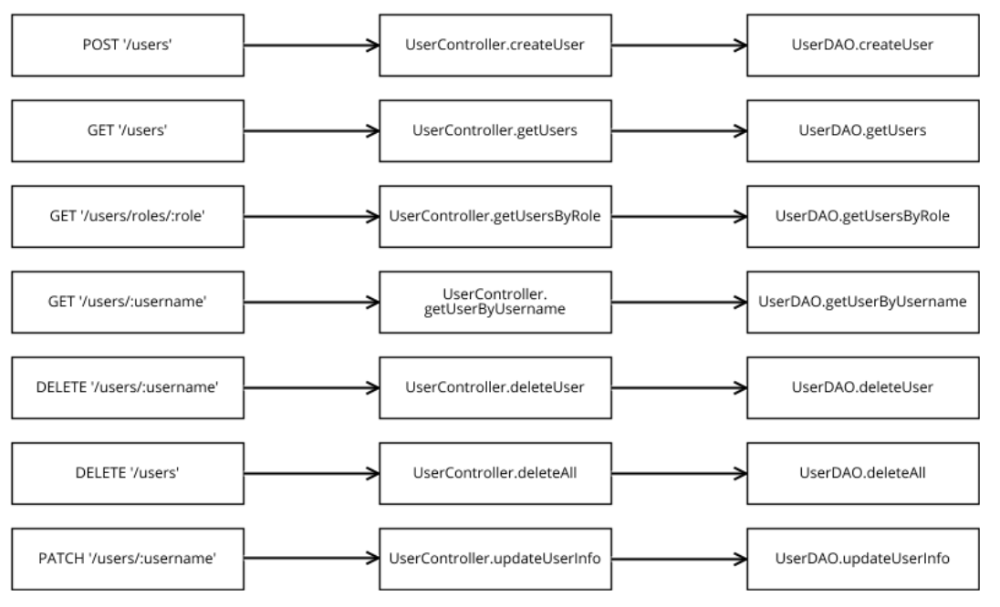
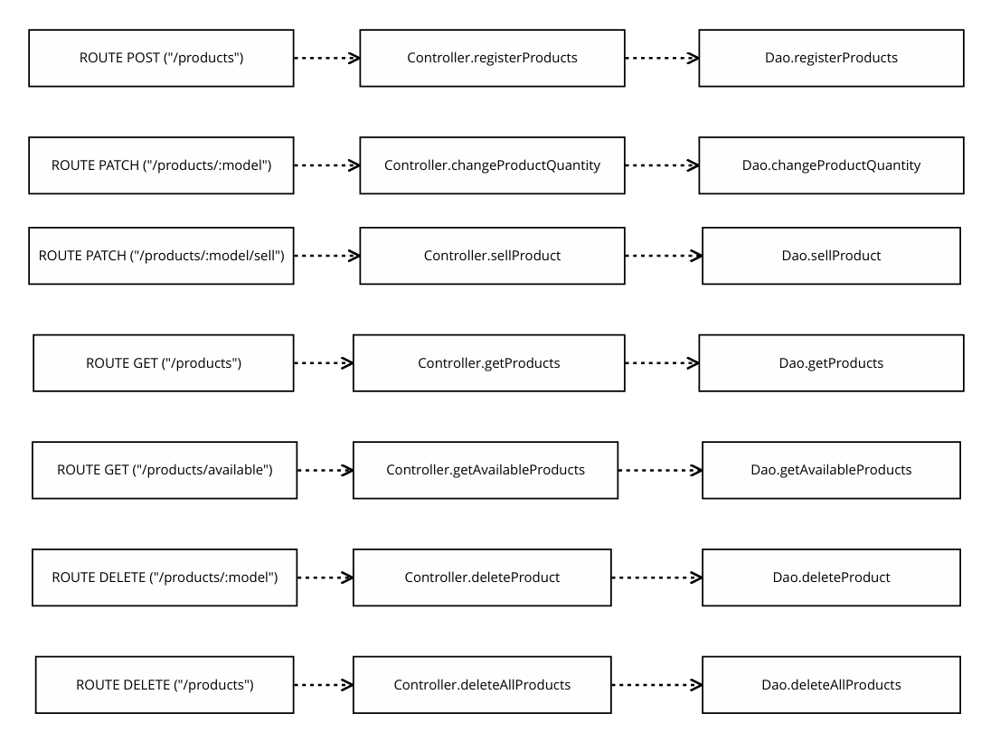
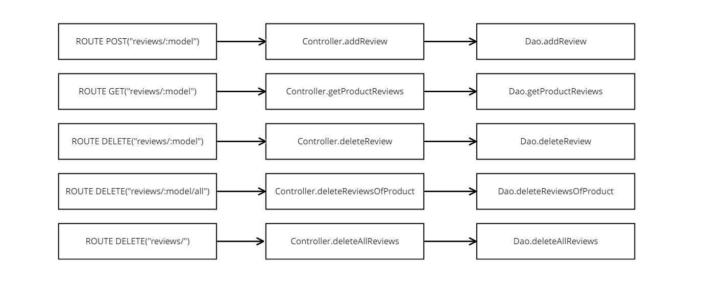
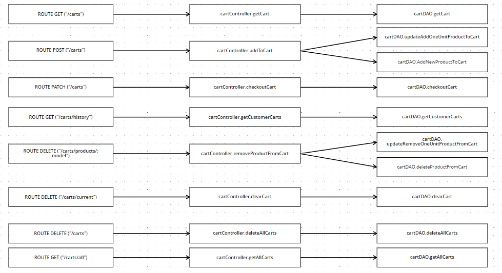

# Test Report

<The goal of this document is to explain how the application was tested, detailing how the test cases were defined and what they cover>

# Contents

- [Test Report](#test-report)
- [Contents](#contents)
- [Dependency graph](#dependency-graph)
- [Integration approach](#integration-approach)
- [Tests](#tests)
  - [Black box test users](#black-box-test-users)
- [Coverage](#coverage)
  - [Coverage of FR](#coverage-of-fr)
  - [Coverage white box](#coverage-white-box)

# Dependency graph

     <report the here the dependency graph of EzElectronics>   
     
  
  
  

# Integration approach

    <Write here the integration sequence you adopted, in general terms (top down, bottom up, mixed) and as sequence

    (ex: step1: unit A, step 2: unit A+B, step 3: unit A+B+C, etc)>

    <Some steps may  correspond to unit testing (ex step1 in ex above)>

    <One step will  correspond to API testing, or testing unit route.js>
  
  Abbiamo adottato il metodo bottom up:
  - step 1: test su funzioni Dao (livello 1 - più basso)
  - step 2: test su funzioni Controller + Dao (livello 2)
  - step 3: test su funzioni Route + Controller + Dao (livello 3 - più alto)

# Tests

<in the table below list the test cases defined For each test report the object tested, the test level (API, integration, unit) and the technique used to define the test case (BB/ eq partitioning, BB/ boundary, WB/ statement coverage, etc)> <split the table if needed>

## Black box test users
User UNIT TEST

| Test case name | Object(s) tested | Test level | Technique used |
| :------------: | :--------------: | :--------: | :------------: |
|                |                  |            |                |
|DAO - createUser|DAO.createUser|1|WB + line and branch coverage|
|DAO - getUser |DAO.getUser|1|WB + line and branch coverage|
|DAO - getUserByRole |DAO.getUserByRole|1|WB + line and branch coverage|
|DAO - getUserByUsername |DAO.getUserByUsername|1|WB + line and branch coverage|
|DAO - deleteUser|DAO.deleteUser|1|WB + line and branch coverage|
|DAO - deleteAll|DAO.deleteAll|1|WB + line and branch coverage|
|DAO - updateUser|DAO.updateUser|1|WB + line and branch coverage|
|CONTROLLER - createUser | Controller.createUser |1 | WB + line and branch coverage|
|CONTROLLER - getUser | Controller.getUser  |1 |  WB + line and branch coverage |
|CONTROLLER - getUsersByRole | Controller.createUsersByRole|1 |  WB + line and branch coverage|
|CONTROLLER - getUserByUsername | Controller.getUserByUsername |1 |  WB + line and branch coverage|
|CONTROLLER - deleteUser | Controller.deleteUser|1 |  WB + line and branch coverage|
|CONTROLLER - deleteAll| Controller.deleteAll |1 |  WB + line and branch coverage|
|CONTROLLER - updateUser| Controller.updateUser |1 |  WB + line and branch coverage|
|POST '/'| userRoute.post('/')|1| WB + line and branch coverage
| GET '/users'|userRoute.get('/users')|1| WB + line and branch coverage
|GET '/users/roles/:role'|userRoute.get('/roles/:role')|1| WB + line and branch coverage
|GET '/users/:username/:role'|userRoute.get('/users/:username')|1| WB + line and branch coverage
|DELETE '/users/:username'|userRoute.delete('/users/:username')|1| WB + line and branch coverage
|DELETE '/users'|userRoute.delete('/users')|1| WB + line and branch coverage
|POST '/users/:username'|userRoute.post('/users/:username')|1| WB + line and branch coverage

Product UNIT TEST
| Test case name | Object(s) tested | Test level | Technique used |
| :------------: | :--------------: | :--------: | :------------: |
| DAO - registerProducts | registerProducts | 1 | WB / BB |
| DAO - changeProductQuantity | changeProductQuantity | 1 | WB / BB |
| DAO - sellProduct | sellProduct | 1 | WB / BB |
| DAO - getProducts | getProducts | 1 | WB / BB |
| DAO - getAvailableProducts | getAvailableProducts | 1 | WB / BB |
| DAO - deleteProduct | deleteProduct | 1 | WB / BB |
| DAO - deleteAllProducts | deleteAllProducts | 1 | WB / BB |
| CONTROLLER - registerProducts | registerProducts | 2 | WB / BB |
| CONTROLLER - changeProductQuantity | changeProductQuantity | 2 | WB / BB |
| CONTROLLER - sellProduct | sellProduct | 2 | WB / BB |
| CONTROLLER - getProducts | getProducts | 2 | WB / BB |
| CONTROLLER - getAvailableProducts | getAvailableProducts | 2 | WB / BB |
| CONTROLLER - deleteProduct | deleteProduct | 2 | WB / BB |
| CONTROLLER - deleteAllProducts | deleteAllProducts | 2 | WB / BB |
| POST - registerProducts | registerProducts | 3 | WB / BB |
| PATCH - changeProductQuantity | changeProductQuantity | 3 | WB / BB |
| PATCH - sellProduct | sellProduct | 3 | WB / BB |
| GET - getProducts | getProducts | 3 | WB / BB |
| GET - getAvailableProducts | getAvailableProducts | 3 | WB / BB |
| DELETE - deleteProduct | deleteProduct | 3 | WB / BB |
| DELETE - deleteAllProducts | deleteAllProducts | 3 | WB / BB |

Review UNIT TEST
| Test case name | Object(s) tested | Test level | Technique used |
| :------------: | :--------------: | :--------: | :------------: |
| DAO - addReview | addReview | 1 | WB / BB |
| DAO - getProductReviews | getProductReviews | 1 | WB / BB |
| DAO - deleteReview | deleteReview | 1 | WB / BB |
| DAO - deleteReviewsOfProduct | deleteReviewsOfProduct | 1 | WB / BB |
| DAO - deleteAllReviews | deleteAllReviews | 1 | WB / BB |
| CONTROLLER - addReview | addReview | 2 | WB / BB |
| CONTROLLER - getProductReviews | getProductReviews | 2 | WB / BB |
| CONTROLLER - deleteReview | deleteReview | 2 | WB / BB |
| CONTROLLER - deleteReviewsOfProduct | deleteReviewsOfProduct | 2 | WB / BB |
| CONTROLLER - deleteAllReviews | deleteAllReviews | 2 | WB / BB |
| POST - addReview | addReview | 3 | WB / BB |
| GET - getProductReviews | getProductReviews | 3 | WB / BB |
| DELETE - deleteReview | deleteReview | 3 | WB / BB |
| DELETE - deleteReviewsOfProduct | deleteReviewsOfProduct | 3 | WB / BB |
| DELETE - deleteAllReviews | deleteAllReviews | 3 | WB / BB |

Cart UNIT TEST 
| Test case name | Object(s) tested | Test level | Technique used |
| :------------: | :--------------: | :--------: | :------------: |
| DAO - getCart|getCart| 1 | WB / BB |
| DAO - createUserCart|createUserCart| 1| WB / BB|
| DAO - updateAddOneUnitProductToCart|updateAddOneUnitProductToCart| 1| WB / BB|
| DAO - AddNewProductToCart |AddNewProductToCart                  | 1           | WB / BB               |
| DAO - checkProductQuantity                |checkProductQuantity                  | 1           | WB / BB               |
| DAO - updateCart                |updateCart                  | 1           | WB / BB               |
| DAO - getCartProducts                |getCartProducts                  | 1           | WB / BB               |
| DAO - checkoutCart                |checkoutCart                  | 1           | WB / BB               |
| DAO - getCartId                |getCartId                  | 1           | WB / BB               |
| DAO - NotEmptyCart                |NotEmptyCart                 | 1           | WB / BB               |
| DAO - ProductAvailability                |ProductAvailability                 | 1           | WB / BB               |
| DAO - getCustomerCarts                |getCustomerCarts                  | 1           | WB / BB               |
| DAO - deleteProductFromCarts                |deleteProductFromCarts                  | 1           | WB / BB               |
| DAO - updateRemoveOneUnitProductToCart               |updateRemoveOneUnitProductToCart                 | 1           | WB / BB               |
| DAO - clearCart               |clearCart                | 1           | WB / BB               |
| DAO - deleteAllCarts               |deleteAllCarts                 | 1           | WB / BB               |
| DAO - getAllCarts                |getAllCarts                  | 1           | WB / BB               |
| CONTROLLER - addToCart               |addToCart                 |    2        | WB / BB               |
| CONTROLLER - getCart               |getCart                |    2        | WB / BB               |
| CONTROLLER - checkoutCart               |checkoutCart                |    2        | WB / BB               |
| CONTROLLER - getCustomerCarts               |getCustomerCarts                |    2        | WB / BB               |
| CONTROLLER - removeProductFromCart               |removeProductFromCart                |    2        | WB / BB               |
| CONTROLLER - clearCart               |clearCart               |    2        | WB / BB               |
| CONTROLLER - deleteAllCarts               |deleteAllCarts             |    2        | WB / BB               |
| CONTROLLER - getAllCarts               |getAllCarts             |    2        | WB / BB               |
| GET - getCart               |getCart                |    3        | WB / BB               |
| POST - addToCart               |addToCart                |    3        | WB / BB               |
| PATCH - checkoutCart               |checkoutCart                |    3        | WB / BB               |
| GET - getCustomerCarts               |getCustomerCarts                |    3        | WB / BB               |
| DELETE - removeProductFromCart               |removeProductFromCart               |    3        | WB / BB               |
| DELETE - clearCart               |clearCart                |    3        | WB / BB               |
| DELETE - deleteAllCarts               |deleteAllCarts               |    3        | WB / BB               |
| GET - getAllCarts               |getAllCarts                |    3        | WB / BB               |

User INTEGRATION TEST
| Test case name | Object(s) tested | Test level | Technique used |
| :------------: | :--------------: | :--------: | :------------: |
|DAO - createUser|DAO.createUser + DB|1|BB|
|DAO - getUser |DAO.getUser + DB|1|BB|
|DAO - getUserByRole |DAO.getUserByRole + DB|1|BB|
|DAO - getUserByUsername |DAO.getUserByUsername + DB|1|BB|
|DAO - deleteUser|DAO.deleteUser + DB|1|BB|
|DAO - deleteAll|DAO.deleteAll + DB|1|BB|
|DAO - updateUser|DAO.updateUser + DB|1|BB|
|CONTROLLER - createUser | Controller.createUser + DAO.createUser + DB |2 | BB|
|CONTROLLER - getUser | Controller.getUser + DAO.getUser + DB |2 | BB|
|CONTROLLER - getUsersByRole | Controller.createUsersByRole + DAO.getUserByRole + DB|2 | BB|
|CONTROLLER - getUserByUsername | Controller.getUserByUsername + DAO.getUserByUsername + DB |2 | BB|
|CONTROLLER - deleteUser | Controller.deleteUser + DAO.deleteUser + DB |2 | BB|
|CONTROLLER - deleteAll| Controller.deleteAll + DAO.deleteAll + DB|2 | BB|
|CONTROLLER - updateUser| Controller.updateUser + DAO.updateUser + DB |2 | BB|
| POST '/'| post route + Controller.createUser + DAO.createUser + DB |  3 |  BB|
| GET '/users'| get route + Controller.getUser + DAO.getUser + DB  |  3 |  BB|
| GET '/users/roles/:role'| get route + Controller.createUsersByRole + DAO.getUserByRole + DB |  3 |  BB|
| GET '/users/:username'| get route + Controller.getUserByUsername + DAO.getUserByUsername + DB |  3 |  BB|
| DELETE '/users/:username'| delete route + Controller.deleteUser + DAO.deleteUser + DB  |  3 |  BB|
| DELETE '/users'| delete route + Controller.deleteAll + DAO.deleteAll + DB |  3 |  BB|
| POST '/users/:username'| post route + Controller.updateUser + DAO.updateUser + DB|  3 |  BB|

Product INTEGRATION TEST
| Test case name | Object(s) tested | Test level | Technique used |
| :------------: | :--------------: | :--------: | :------------: |
| DAO - registerProducts | registerProducts | 1 | BU |
| DAO - changeProductQuantity | changeProductQuantity | 1 | BU |
| DAO - sellProduct | sellProduct | 1 | BU |
| DAO - getProducts | getProducts | 1 | BU |
| DAO - getAvailableProducts | getAvailableProducts | 1 | BU |
| DAO - deleteProduct | deleteProduct | 1 | BU |
| DAO - deleteAllProducts | deleteAllProducts | 1 | BU |
| CONTROLLER - registerProducts | registerProducts | 2 | BU |
| CONTROLLER - changeProductQuantity | changeProductQuantity | 2 | BU |
| CONTROLLER - sellProduct | sellProduct | 2 | BU |
| CONTROLLER - getProducts | getProducts | 2 | BU |
| CONTROLLER - getAvailableProducts | getAvailableProducts | 2 | BU |
| CONTROLLER - deleteProduct | deleteProduct | 2 | BU |
| CONTROLLER - deleteAllProducts | deleteAllProducts | 2 | BU |
| POST - registerProducts | registerProducts | 3 | BU |
| PATCH - changeProductQuantity | changeProductQuantity | 3 | BU |
| PATCH - sellProduct | sellProduct | 3 | BU |
| GET - getProducts | getProducts | 3 | BU |
| GET - getAvailableProducts | getAvailableProducts | 3 | BU |
| DELETE - deleteProduct | deleteProduct | 3 | BU |
| DELETE - deleteAllProducts | deleteAllProducts | 3 | BU |

Review INTEGRATION TEST
| Test case name | Object(s) tested | Test level | Technique used |
| :------------: | :--------------: | :--------: | :------------: |
| DAO - addReview | addReview | 1 | BU |
| DAO - getProductReviews | getProductReviews | 1 | BU |
| DAO - deleteReview | deleteReview | 1 | BU |
| DAO - deleteReviewsOfProduct | deleteReviewsOfProduct | 1 | BU |
| DAO - deleteAllReviews | deleteAllReviews | 1 | BU |
| CONTROLLER - addReview | addReview | 2 | BU |
| CONTROLLER - getProductReviews | getProductReviews | 2 | BU |
| CONTROLLER - deleteReview | deleteReview | 2 | BU |
| CONTROLLER - deleteReviewsOfProduct | deleteReviewsOfProduct | 2 | BU |
| CONTROLLER - deleteAllReviews | deleteAllReviews | 2 | BU |
| POST - addReview | addReview | 3 | BU |
| GET - getProductReviews | getProductReviews | 3 | BU |
| DELETE - deleteReview | deleteReview | 3 | BU |
| DELETE - deleteReviewsOfProduct | deleteReviewsOfProduct | 3 | BU |
| DELETE - deleteAllReviews | deleteAllReviews | 3 | BU |

Cart INTEGRATION TEST 
| Test case name | Object(s) tested | Test level | Technique used |
| :------------: | :--------------: | :--------: | :------------: |
| DAO - getCart|getCart| 1 | BU |
| DAO - createUserCart|createUserCart| 1| BU|
| DAO - updateAddOneUnitProductToCart|updateAddOneUnitProductToCart| 1| BU|
| DAO - AddNewProductToCart |AddNewProductToCart                  | 1           | BU              |
| DAO - checkProductQuantity                |checkProductQuantity                  | 1           | BU               |
| DAO - updateCart                |updateCart                  | 1           | BU               |
| DAO - getCartProducts                |getCartProducts                  | 1           | BU              |
| DAO - checkoutCart                |checkoutCart                  | 1           | BU               |
| DAO - getCartId                |getCartId                  | 1           | BU               |
| DAO - NotEmptyCart                |NotEmptyCart                 | 1           | BU              |
| DAO - ProductAvailability                |ProductAvailability                 | 1           | BU               |
| DAO - getCustomerCarts                |getCustomerCarts                  | 1           | BU              |
| DAO - deleteProductFromCarts                |deleteProductFromCarts                  | 1           | BU               |
| DAO - updateRemoveOneUnitProductToCart               |updateRemoveOneUnitProductToCart                 | 1           | BU              |
| DAO - clearCart               |clearCart                | 1           | BU               |
| DAO - deleteAllCarts               |deleteAllCarts                 | 1           | BU              |
| DAO - getAllCarts                |getAllCarts                  | 1           | BU               |
| CONTROLLER - addToCart               |addToCart                 |    2        | BU               |
| CONTROLLER - getCart               |getCart                |    2        | BU               |
| CONTROLLER - checkoutCart               |checkoutCart                |    2        | BU              |
| CONTROLLER - getCustomerCarts               |getCustomerCarts                |    2        | BU               |
| CONTROLLER - removeProductFromCart               |removeProductFromCart                |    2        | BU               |
| CONTROLLER - clearCart               |clearCart               |    2        | BU              |
| CONTROLLER - deleteAllCarts               |deleteAllCarts             |    2        | BU              |
| CONTROLLER - getAllCarts               |getAllCarts             |    2        | BU             |
| GET - getCart               |getCart                |    3        | BU              |
| POST - addToCart               |addToCart                |    3        | BU               |
| PATCH - checkoutCart               |checkoutCart                |    3        | BU               |
| GET - getCustomerCarts               |getCustomerCarts                |    3        |BU             |
| DELETE - removeProductFromCart               |removeProductFromCart               |    3        | BU               |
| DELETE - clearCart               |clearCart                |    3        | BU              |
| DELETE - deleteAllCarts               |deleteAllCarts               |    3        | BU             |
| GET - getAllCarts               |getAllCarts                |    3        |BU              |

# Coverage

## Coverage of FR

<Report in the following table the coverage of functional requirements and scenarios(from official requirements) >

| Functional Requirement or scenario | Test(s) |
| :--------------------------------: | :-----: |
| **FR1** | **Manage account** |
|  FR1.1  | DAO/CONTROLLER/POST - login | |
|  FR1.2  | DAO/CONTROLLER/POST - logout | |
|  FR1.3  | DAO/CONTROLLER/POST - currentUser | |
| **FR2** | **Manage users** |
|  FR2.1  | DAO/CONTROLLER/POST - createUser |
|  FR2.2  | DAO/CONTROLLER/POST - getUser|
|  FR2.3  | DAO/CONTROLLER/POST - getUserByRole |
|  FR2.4  | DAO/CONTROLLER/POST - getUserByUsername |
|  FR2.5  | DAO/CONTROLLER/POST - deleteUser |
|  FR2.6  | DAO/CONTROLLER/POST - deleteAll |
|  FR2.7  | DAO/CONTROLLER/POST - deleteUser |
| **FR3** | **Manage products** |
|  FR3.1  | DAO/CONTROLLER/POST - registerProducts |
|  FR3.2  | DAO/CONTROLLER/PATCH - changeProductQuantity |
|  FR3.3  | DAO/CONTROLLER/PATCH - sellProduct |
|  FR3.4  | DAO/CONTROLLER/GET - getProducts |
| FR3.4.1 | DAO/CONTROLLER/GET - getAvailableProducts |
|  FR3.5  | DAO/CONTROLLER/GET - getProducts |
| FR3.5.1 | DAO/CONTROLLER/GET - getAvailableProducts |
|  FR3.5  | DAO/CONTROLLER/GET - getProducts |
| FR3.5.1 | DAO/CONTROLLER/GET - getAvailableProducts |
|  FR3.7  | DAO/CONTROLLER/DELETE - deleteProduct |
|  FR3.8  | DAO/CONTROLLER/DELETE - deleteAllProducts |
| **FR4** | **Manage reviews** |
|  FR4.1  | DAO/CONTROLLER/POST - addReview |
|  FR4.2  | DAO/CONTROLLER/GET - getProductReviews |
|  FR4.3  | DAO/CONTROLLER/DELETE - deleteReview |
|  FR4.4  | DAO/CONTROLLER/DELETE - deleteReviewsOfProduct |
|  FR4.5  | DAO/CONTROLLER/DELETE - deleteAllReviews |
| **FR5** |  **Manage carts** |
|  FR5.1  | DAO/CONTROLLER/GET - getCart |
|  FR5.2  | DAO/CONTROLLER/POST - addToCart |
|  FR5.3  | DAO/CONTROLLER/PATCH - checkoutCart |
|  FR5.4  | DAO/CONTROLLER/GET - getCustomerCarts |
|  FR5.5  | DAO/CONTROLLER/DELETE - removeProductFromCart |
|  FR5.6  | DAO/CONTROLLER/DELETE - clearCart |
|  FR5.7  | DAO/CONTROLLER/GET - getAllCarts |
|  FR5.8  | DAO/CONTROLLER/DELETE - deleteAllCarts |

## Coverage white box

Report here the screenshot of coverage values obtained with jest-- coverage

All file coverage

Controller coverage

Dao coverage

Route coverage
