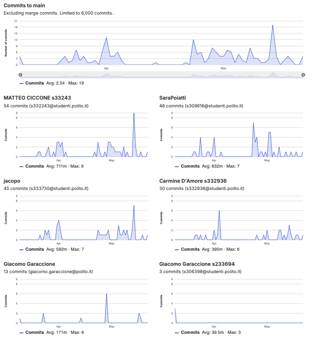

# Gruppo 30

## Valutazione deliverable V1

| gruppo | context diagram | business model | stakeholder | stories | interface | FR | NFR | use cases diagram | use cases | scenario | Glossary | DeploymentDiagram | functionality | estimation doc | precisione valori estimation | valutazione |
| --- | --- | --- | --- | --- | --- | --- | --- | --- | --- | --- | --- | --- | --- | --- | --- | --- |
| - | 1 | 0.5 | 0.5 | 1 | 1 | 3 | 3 | 1 | 5 | 5 | 5 | 2 | 1 | 2 | 2 | 33 |
| 30 | 100 | 100 | 95 | 100 | 100 | 100 | 95 | 100 | 100 | 100 | 70 | 100 | 100 | 90 | 95.15 | 95.55 |

## Valutazione deliverable V2

| gruppo | context diagram | business model | stakeholder | stories | interface | FR | NFR | ACCESS RIGHTS | use cases diagram | use cases | scenario | Glossary | DeploymentDiagram | functionality | estimation | precisione valori estimation | valutazione |
| --- | --- | --- | --- | --- | --- | --- | --- | --- | --- | --- | --- | --- | --- | --- | --- | --- | --- |
| - | 1 | 0.5 | 0.5 | 1 | 1 | 3 | 2 | 1 | 1 | 5 | 5 | 5 | 2 | 1 | 2 | 2 | 33 |
| 30 | 100 | 100 | 100 | 100 | 100 | 100 | 100 | 100 | 100 | 100 | 100 | 100 | 100 | 100 | 100 | 96.23 | 101.3 |

Le percentuali di v2 sono state riscalate in quanto la media pesata delle percentuali portava alcuni gruppi oltre al 100%.

## Valutazione codice e test (V2 + V3)

| Test Unit Totali | Test Unit Passati | Statement Coverage Unit | Branch Coverage Unit | Function Coverage Unit | Line Coverage Unit | Test Integration Totali | Test Integration Falliti | Statement Coverage Integration | Branch Coverage Integration | Function Coverage Integration | Line Coverage Integration | Correttezza V2 | Correttezza V3 | valutazione |
| --- | --- | --- | --- | --- | --- | --- | --- | --- | --- | --- | --- | --- | --- | --- |
| 1 | 0.5 | 2 | 2 | 1 | 1 | 1 | 0.5 | 2 | 2 | 1 | 1 | 16 | 2 | 33 |
| 100 | 100 | 100 | 100 | 100 | 100 | 100 | 100 | 75 | 50 | 100 | 75 | 83.1932773109244 | 100 | 86.55 |

 Unit e integration test prodotti dai gruppi sono stati eseguiti con la versione V2 del codice.

## Risultati Progetto

| Deliverable | Punteggio | Peso |
| --- | --- | --- |
| **Documenti V1** | 95.55% | 6 |
| **Documenti V2** | 99.94% | 2 |
| **Codice e Test** | 86.55% | 22 |
| **Timesheet** | 100.0% | 3 |
| **Valutazione** | 29.77 | 33 |
| **Valutazione** | 11.91 | 13.2 |

## Calcolo pesi progetto per singolo studente

| cognome | nome | email | gruppo | commit studente | commit totali | commit sul totale | coefficiente catme | coefficiente pesato | coefficiente progetto |
| --- | --- | --- | --- | --- | --- | --- | --- | --- | --- |
| CICCONE | MATTEO | s332243@studenti.polito.it | 30 | 54 | 177 | 0.31 | 1.04 | 0.89 | 1.00 |
| D'AMORE | CARMINE | s332936@studenti.polito.it | 30 | 30 | 177 | 0.17 | 0.93 | 0.78 | 0.87 |
| POIATTI | SARA | s309616@studenti.polito.it | 30 | 48 | 177 | 0.27 | 1.05 | 0.89 | 1.00 |
| SANTOLUPO | JACOPO | s333730@studenti.polito.it | 30 | 45 | 177 | 0.25 | 0.95 | 0.81 | 0.91 |

 I pesi del progetto sono ottenuti per l'80% dal valore calcolato da CATME e per il 20% dalla percentuale dei commit del singolo studente sul totale dei commit effettuati dagli studenti dello stesso gruppo. Il risultato è stato poi riscalato in modo che il punteggio più alto del gruppo ottenesse 1.

## Studenti

| Nome | Matricola | Email | Bonus | Voto Primo Appello | Voto Progetto | Voto Finale |
| --- | --- | --- | --- | --- | --- | --- |
| MATTEO CICCONE | 332243 | s332243@studenti.polito.it | 1 | 17.4 | 11.89 | 30 |
| SARA POIATTI | 309616 | s309616@studenti.polito.it | 0 | 16.58 | 11.91 | 28 |
| JACOPO SANTOLUPO | 333730 | s333730@studenti.polito.it | 0 | 14.6 | 10.80 | 25 |
| CARMINE D'AMORE | 332936 | s332936@studenti.polito.it | 0 | 13.7 | 10.36 | 24 |
